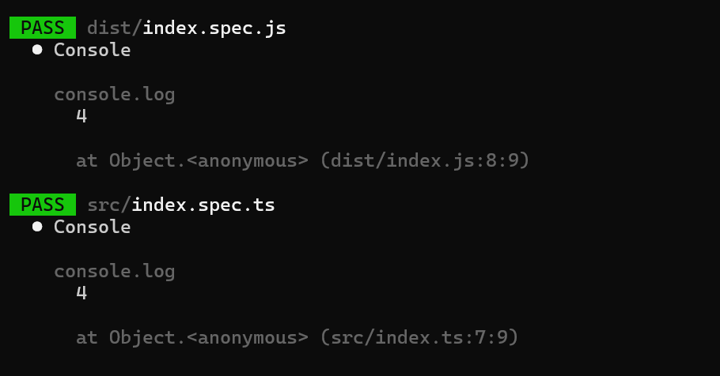
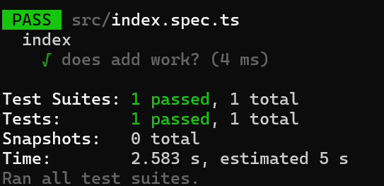

# Creating a Node Tool With TypeScript and Jest From Scratch

In a [previous post](./create-node-project.md), I showed how to create a Node project from scratch. This is a great basis to start building other types of projects, so in this post, I'm going to show you how to build a tool that you can install via [npm](https://www.npmjs.com/).

One of my favorite tools to use is [gitignore](https://www.npmjs.com/package/gitignore), useful for generating a stock `.gitignore` file for all sorts of projects.

Let's get started!

_Note: Do you prefer learning via video? You can find [a version of this article on YouTube](https://youtu.be/Cm8T8N1pfnw)_

At a high level, we'll be doing the following

1. [Setting the Foundation](#step-1---setting-the-foundation)
1. [Update our project to compiler TypeScript to JavaScript](#step-2---compiling-typescript-to-javascript)
1. [Update our testing workflow](#step-3---updating-jest-to-run-the-right-files)
1. [Set up our executable](#step-4---setting-up-the-executable)

## Step 0 - Dependencies

For this project, the only tool you'll need is the Long Term Support (LTS) version of Node (as of this post, that's v22, but these instructions should hold regardless). If you're working with different Node applications, then I _highly_ recommend using a tool to help you juggle the different versions of Node you might need (Your options are [nvm](https://github.com/nvm-sh/nvm) if you're on Mac/Linux or [Node Version Manager for Windows](https://github.com/coreybutler/nvm-windows) if you're on Windows).


## Step 1 - Setting The Foundation

The vast majority of work we need was created as part of [build a basic node project](./create-node-project.md), so make sure to complete the steps there first before proceeding!

## Step 2 - Compiling TypeScript to JavaScript

In order for another application to use our library, we need to make sure we're shipping JavaScript, not TypeScript. To make that happen, we're going to be using the TypeScript compiler, `tsc` to help us out.

### Telling TypeScript Where To Find Files

When we [first setup TypeScript](./create-node-project.md#setting-up-typescript), we created a basic `tsconfig.json` file and kept the defaults. However, in order to publish a library, we need to set two more `compilerOptions` in the file.

First, we need to set the `outDir` property so that our compiled code all goes into a single directory. If we don't do this, our JavaScript files be next to our TypeScript files and that creates a mess.

Second, we need to set the `rootDir` property so that the TypeScript compiler knows where to search for our code.

Let's go ahead and make those changes in the `tsconfig.json` file.

```json
// existing code
"compilerOptions": {
  // existing code
  "outDir": "dist", // This tells the TypeScript compiler where to put the compiled code at
  "rootDir": "src", // This tells the TypeScript compiler where to search for TypeScript code to compile
}
// existing code
```

### Adding a build script

Now that we've told TypeScript which files to compile and where to put those files, we can update our `package.json` file with a build script that will invoke the TypeScript compiler, `tsc` when ran:

```json
{
  // existing code
  "script":{
    "build": "tsc"
    // existing scripts
  }
  // existing code
}

```

With this script in place, we can run `npm run build` from the command line and we'll see that a `dist` folder was created with some JavaScript files inside.

### Improving the Build with Rimraf

Now that we have compilation happening, we need a way to make sure our `dist` folder is cleaned out before a new compilation as this helps make sure that we don't have old files hanging around. This will also simulate our Continuous Integration pipeline when we start working on that.

We could update our build script with something like `rm -rf dist`, but that's a Linux command, which most likely won't work on Windows. So let's add a new library, [rimraf](https://www.npmjs.com/package/rimraf), that handles removing files in an OS agnostic way.

```sh
npm install --save-dev rimraf
```

After installing, we can update our build script to be the following.

```json
{
  "build": "rimraf dist && tsc"
}
```

Now, when we run `npm run build`, we'll see that the `dist` folder is removed and then recreated.

## Step 3 - Updating Jest to Run the Right Files

At this point, we have our TypeScript being compiled into JavaScript, so we're close to being ready to publish our tool. As a sanity check, let's go ahead and run our test suite from [step 1](#step-1-setting-the-foundation)

```sh
npm run test
```



Uh oh, it looks like `jest` is not only running the tests in the `src` folder, but also in the `dist` folder. We'll need to tweak our `jest.config.js` file to ignore the dist folder.

```js
// existing code
module.exports = {
  //existing code
},
testPathIgnorePatterns: ['dist/'] // this will ignore any matches in the dist folder
```

If we run our test command again, we'll only see the index.spec.ts file in the listing.



## Step 4 - Setting up the executable

### Adding Bin to Package.json

Now, it's time to tell `npm` which file to execute as part of the tool. 

First, we need to update our `package.json` file to include a new property [bin](https://docs.npmjs.com/cli/v11/configuring-npm/package-json#bin).

```json
{
  // existing code
  "main": "index.js",
  "bin": {
    "nameOfExecutable": "dist/index.js"
  }
}
```

So if we wanted the name of our tool to be `greet`, then we would update the "nameOfExecutable" to be `greet`.

### Updating Index With Shebang

If we tried to run our tool now, we'd see that nothing would happen, but the file would be opened in a text editor.

It turns out, that if we don't add a _[shebang]_(https://en.wikipedia.org/wiki/Shebang_(Unix)) to the file, then Node doesn't know that it should execute this file. 

So let's update our `index.ts` file

```ts
#!/usr/bin/env node
// rest of the file
```

## Step 5 - Building the Tool

With this final step, we're in a good place to build our tool and try it out.

To create the package, we need to run two commands:

```sh
npm run build # This creates a clean folder with our code to deploy
npm pack # This creates a tarball that has our code, which we can execute via npx
```


## Next Steps

With this final step done, we have a great foundation for building out our tool! For example, you could build your own version of [gitignore], maybe a command line interface that wraps around a favorite tool of yours, the sky's the limit!

