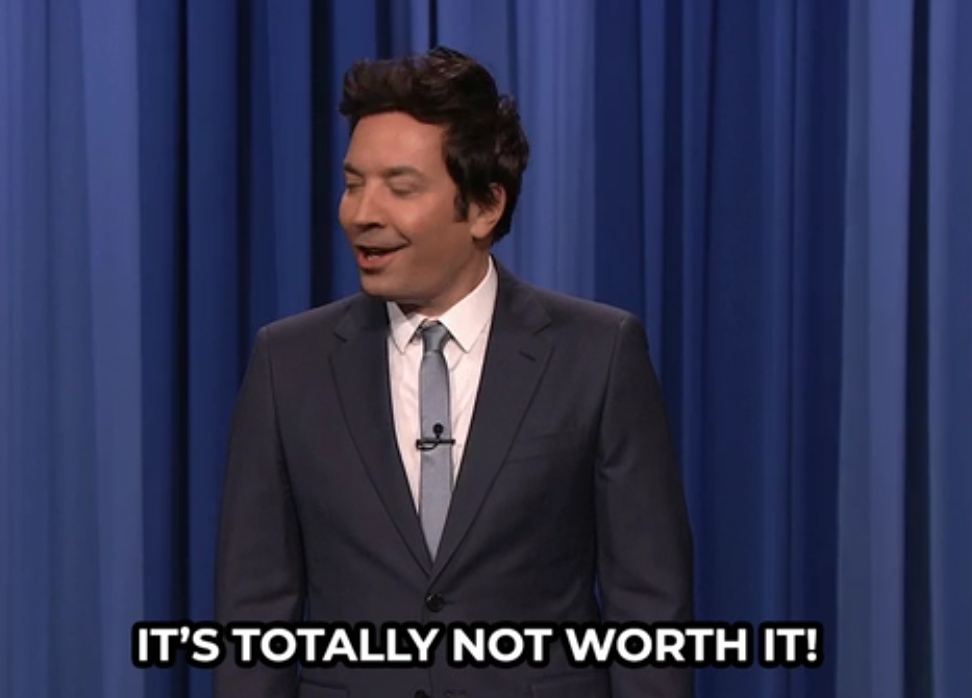

# Running Effective Experiments With the Team

As a leader, you're always on the look out for new tools and approaches to help the team be more effective.

But what happens when you have an idea? How do you introduce it to the team and get buy-in? How do you encourage others to propose ideas as well (remember, you're job isn't to have all the ideas, but to encourage and choose the best ones).

Let's say that the idea works, what happens next? What if it failed, what do you do next? How do you share your lessons with others?

In this post, I'll walk you through my approach for running experiments with the team and how to answer these questions. Like any other advice, I've found success using this process, but you might find that you'll need to tweak or adjust for your team.

## Working In the Open

When it comes to the team, I'm a big proponent of working in the open. Not only does this reduce the amount of questions from my leader about what we're doing, it also empowers others to chime in when they see something off or the team going down the wrong path.

With this philosophy in mind, I document our experiments in the team wiki. Now, I know that we should [favor people over processes](http://agilemanifesto.org/), however, I have found immense value in taking the 10 minutes to document as this helps get everyone on the same page and when we look at these experiments later, we have the context behind the experiment.

To me, this no different than a scientist writing down their experiments for later reference.

## Defining an Experiment

As you might have guessed, I'm a big fan of using the [scientific method](https://en.wikipedia.org/wiki/Scientific_method) for engineering work and especially so when it comes to experiments. As such, I capture the following info:

<figure>

<figcaption>
Seriously, if we're not taking notes, what kind of scientists are we?
</figcaption>
<figcaption>
Photo by <a href="https://unsplash.com/@_louisreed?utm_content=creditCopyText&utm_medium=referral&utm_source=unsplash">Louis Reed</a> on <a href="https://unsplash.com/photos/refill-of-liquid-on-tubes-pwcKF7L4-no?utm_content=creditCopyText&utm_medium=referral&utm_source=unsplash">Unsplash</a>
  </figcaption>
</figure>

- Context - Why are we doing this? What inspired the experiment or what problem are we trying to solve?
- Hypothesis - What change are we proposing and what outcome are we looking for?
- Implementation - How are we going to run this experiment?
- Duration - How long are we going to run this experiment for?
- (Optional) Immediate Failure Criteria - Is there anything that could happen during this experiment that would cause to immediately stop?

_For those looking for a template, you can find a markdown version [in my Leadership Toolkit on GitHub](https://github.com/cameronpresley/leadership-toolkit)_

## Scheduling the Retrospective

With the experiment documented, I send a meeting request the day after the experiment is scheduled to end. The goal of this meeting is to reflect on the experiment and to decide whether we should adopt the changes or to stop.

## Leading the Team

After sending this meeting, my job is to help the team implement the experiment and coach/encourage as needed. Since it's a process change, it might take a bit for the team to adjust, so showing some patience and understanding is critical here.

While we are going the through the experiment, I'm going to note any changes that I'm noticing. For example, if we're running an experiment to have asynchronous stand-ups, I'm going to take notes on how I'm feeling about the team getting updates and how they're communicating with each other.

Depending on what comes up in our [one-on-ones](./building-relationships-through-one-on-ones.md#bonus---seeding-a-conversation), I might even use this as a starter question.

## Retrospective

Once the experiment has ran its course, it's time to reflect on the experiment and decide as a team on whether to adopt the changes or reject them.

To prepare, I'd recommend [getting the right people in the room](./more-effective-meetings.md#step-3-do-you-have-the-right-people) and [setting the context](./more-effective-meetings.md#step-2-how-do-we-even-know-if-were-successful).

During the retro, the team should be doing the majority of the talking. Your role is to seed the conversation and make sure everyone gets their opinions out. I like to capture these notes on a board so that the team has clear visibility on what worked and didn't work.

Once the notes have been added to the board, it's time for the team to decide to adopt the changes or not. During this step, I remind the team that this process isn't set in stone and if we want to tweak it in a future experiment, that's normal and encouraged.

At this point, I update the experiment write-up that [we did earlier](#defining-an-experiment) with the team decision and the logic behind the decision. This provides an easy way of sharing our lessons with others.

## Sharing Outcomes With Others

One cool thing about leading teams is that no two teams are the same. Between the personalities, skills, company culture, and motivations, what works for one team won't work for another team (and the other way around).

Because of this, it's critical to share your results with your leader and your peers. This way, they could see what we did, what worked, what didn't work, and hopefully get inspired to run their own experiments with teams.

If the team paid a learning tax for an experiment, why wouldn't we share those results with others so that they can learn from our experiences? They might be able to make suggestions to turn a failure into a success or to ask questions about how we dealt with an issue.

The group being successful is your success, do don't hoard knowledge, share it with others!

With the write-up completed, you can start simply by sending a link to the group. A better approach would be to have a standing agenda item for your team lead meeting where leaders can talk about experiments that have been ran recently and their outcomes.

## Common Mistakes

When I've worked with leaders to introduce experiments, it can be a lot to take in because this is a different way of thinking. This is especially true if leaders are not in a psychologically safe environment or if they have priori experiences that weren't successful.

I can't guarantee that you'll run experiments flawlessly, however, if you avoid these common mistakes, your odds of success will be higher.

### Not Time Boxing the Experiment

One of the key features of the experiment is that it's only going to run for a set period of time, so that if you find that it's not working, you've not permanently impacted the team.

If you have an experiment that's going to run into perpetuity, that's not an experiment anymore, that's a process change and that shouldn't go through this workflow because experiments can be abandoned, but process changes typically can't.

### Treating Experiments as Foregone Conclusions

At some point, you're going to get a directive from your leader that you don't agree with, but you need to commit to the idea anyway. You know the idea isn't going to go over with the team, so you think framing it as an experiment can soften the blow.

DON'T DO THIS!

<figure markdown>
{width=500px}
<figcaption>
Really, don't do this!
</figcaption>
</figure>

Experiments are just that, experiments. They are not a vehicle for you to make unpopular changes. If you use experiments for slipping in these types of changes, then the team will learn that experiments is code for "not great idea" and they'll stop using the process.

Remember, experiments are ideas that you and the team come up with to make things better, not directives from the top coming down.

Now, you _could_ use an experiment to figure out a way to carry out the directive. A good leader tells you where we have to go, but not necessarily how to get there. The experiment could be to figure out how to get there, but not what the destination should be.

### Running Multiple Experiments

When getting a new team or after identifying multiple areas that a team could improve in, it's going to be tempting to want to implement multiple changes at once.

Resist the urge.

Remember, an experiment, by definition, is a process change. So the more experiments you run, the more process changes happening, which in turn puts more stress on the team to remember all the changes.

In addition to all the process changes, you might find that one experiment futzes with another experiment and you may not get clear results.

Let's say that we had two experiments going on at the same, asynchronous stand-ups and spending Tuesday afternoons in independent learning. During your one-on-ones, you get some feedback that it's a bit odd to not know what other team members are working on.

What's driving that? Is it the async stand-ups? Or is it the dedicated learning time? Could it be both? You can't be sure.

Another way to think about this is to think about debugging a program. If something's not working, do you change 5 things at once? No, you're going to change one thing, re-run, and see what happens.

Same thing for experiments.

<blockquote>
But Cameron! This team is a hot mess and could stand to improve in so many areas, what should I do then?
</blockquote>

Instead of running all the experiments, instead, the team should decide which experiment would have the biggest payoff and then pursue that one. Remember, you're not playing the short game, but you're in for the long haul, so you'll have the time to make those changes.
