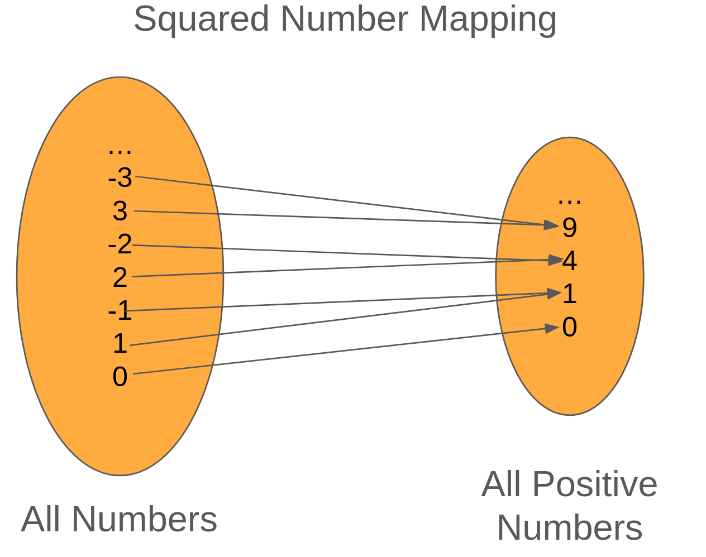
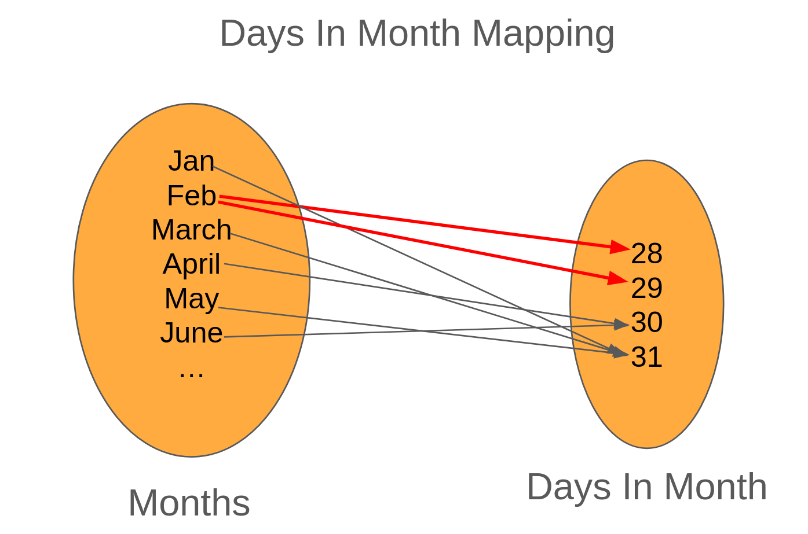
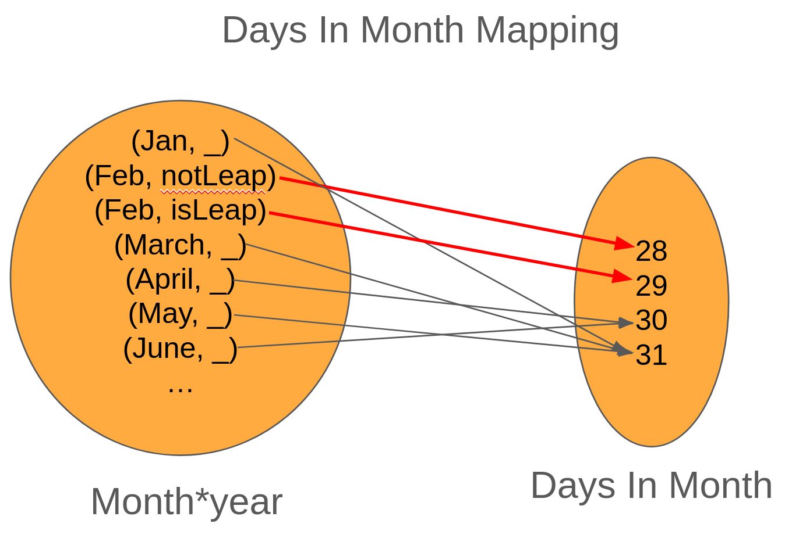
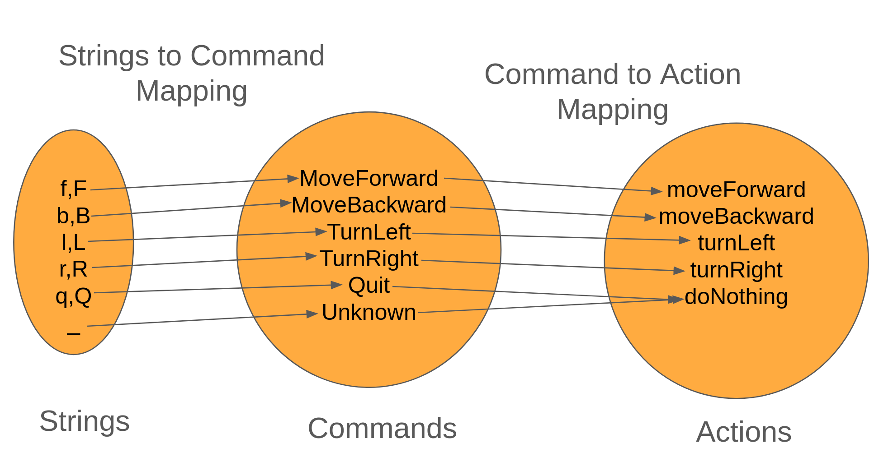

# Functional Foundations - Dealing with Missing Values

In a [previous post](./fp-function.md), we went over the power of functions and how much heavy lifting they can do for us.

In this post, we're going to explore a common pattern for when you have a function that can't return a value.

## When Things Go Wrong

When working with functions, there are going to be times where we can't always map the input to a consistent output.

For example, let's take a look at a common function, _divide_. With this implementation, we'll get the integer result of the division (so `divide(14,4)` would be 3, not 3.66666)

```ts
function divide(dividend: number, divisor: number): number {
  let quotient = 0;
  while (dividend >= divisor) {
    dividend -= divisor;
    quotient++;
  }
  return quotient;
}
console.log(divide(14,4)); // 3
console.log(divide(8,2)); // 4
```

This code works, but what happens when we pass in zero?


```ts
console.log(divide(14,0)); // infinite loop!
```

In this case, we have a mapping that isn't a function because we can't handle all cases (cases where the `divisor` is 0.)

Now, you could do what this Redditor's [principal/teacher suggested and say that anything divided by zero is zero](https://www.youtube.com/watch?v=WI_qPBQhJSM). However, that's going to cause you an issue down the road.

In JavaScript/TypeScript, you don't get an error by dividing by zero, but get infinity instead. This in turn causes some weird issues down the road.

```ts
const result = 4/0; // result is Infinity
console.log(result + 2); // logs Infinity
const negativeInfinity = -4/0;
console.log(negativeInfinity); // logs -Infinity
console.log(result + negativeInfinity) // logs NaN (Not a Number)
```

Long story short, we've got an incomplete mapping, which means no function.

When this happens, we've got two choice to fix the issue

- Restrict the inputs
- Expand the output

In our case, restricting the input would be to design a type that includes all numbers but 0.

We _could_ do that, but creating a type that allows all numbers but 0 would be a bit difficult.

Given that, let's take a look at _expanding_ the output for the function.

Right now, our signature for `divide` is `(number, number) => number`, but the issue is that we won't always have a number.

## Leveraging Undefined

One approach would be to return `undefined` when the divisor is zero. This would make `divide` look like the following

```ts
function divide(dividend:number, divisor:number): number|undefined {
  if (divisor === 0) {
    return undefined;
  }
  // rest of divide implementation
}

console.log(divide(4, 2)); // logs 2
console.log(divide(14, 4)); // logs 3
console.log(divide(5, 0)); // logs undefined
```
This is a good step forward as it tells us that the `divide` function may fail and the compiler will help us along.

```ts
function square(a:number):number{
  return a*a;
}

const result = divide(14,4); // will be 3
// this won't work because result could be undefined
const answer = square(result);
console.log(answer);
```

Now that the compiler is catching our undefined, we need to start introducing error handling. For example, we could update our testing to check for undefined explicitly.

```ts
const result = divide(14, 4);
if (result === undefined) {
  console.log("Couldn't compute answer");
} else {
  const answer = square(result);
  console.log(answer);
}
```

This is okay for now, but let's say that we needed to work with other functions that could also fail (squareRoot for example). Now our code would have to look like this.

```ts
function squareRoot (a:number): number|undefined {
  if (a < 0) {
    return undefined;
  }
  return Math.sqrt(a);
}
const result = divide(14, 4);
if (!result) {
  console.log("Couldn't compute answer");
} else {
  const answer = squareRoot()
}


## Call Me Maybe?

In those cases where we don't always have a value, there's another type we can leverage, called `Maybe` (in other languages it's known as `Option`).


> When this happens, we've got two choices to resolve the problem:

> - Restrict the inputs to be valid (in our case, remove 0 from being an option)
> - Expand the output to handle the case (in our case, it could return a number OR an error message)


Since we have an incomplete mapping, we've got two approaches for


In mathematics, we have a `divide` function

> As such, a _function_ is a mapping from two sets such that for every element of the first set, it maps to a single element in the second set.

Words are cool, but pictures are better. So let's look at the mapping for the `square` function.

{width=800px}

In this example, we have an arrow coming from an element on the left where it _maps_ to an element on the right. To read this image, we have a mapping called _Square_ that maps all possible numbers to the set of positive numbers. So -3 maps to 9 (-3*-3), 2 maps to 4 (2*2), so on and so forth.

To check if our mapping is a function, we need to check that every element on the left is mapped to a single element on the right. If so, then we've got a function!

Sounds easy, right? Let's take a look at a mapping that isn't a function.

## Love in the Air?

When working with dates, it's common to figure out how many days are in the month. Not only does this help with billable days, but it also makes sure that we don't try to send invoices on May 32nd.

So let's take a look at a mapping from month to the number of days it has.

{width=800px}

Looking at the mapping, we can tell that January, March, May map to 31, April and June both map to 30. But take a look at February. It's got _two_ arrows coming out of it, one to 28 and the other to 29. Because there are two arrows coming out, this mapping isn't a function. Let's try to implement this mapping in TypeScript.


```ts
type Month = "Jan" | "Feb" | "Mar" | "Apr"
           | "May" | "Jun" | "Jul" | "Aug"
           |"Sept" | "Oct" | "Nov" | "Dec";

type DaysInMonth = 28 | 29 | 30 | 31;

function getDaysInMonth(month: Month): DaysInMonth {
  switch (month) {
    case "Jan":
    case "Mar":
    case "May":
    case "Jul":
    case "Oct":
    case "Dec":
      return 31;

    case "Feb":
      // what should this be?

    case "Apr":
    case "Jun":
    case "Aug":
    case "Sept":
    case "Nov":
      return 30;
  }
}

```

We can't return 28 all the time (we'd be wrong 25% of the time) and we can't return 29 all the time (as we'd be wrong 75% of the time). So how do we know? We need to know something about the year. One approach would be to check if the current year is a leap year ([algorithm](https://learn.microsoft.com/en-us/office/troubleshoot/excel/determine-a-leap-year)).

```ts
function isLeapYear(): boolean {
  const year = new Date().getFullYear();
  if (year % 400 === 0) return true;
  if (year % 100 === 0) return false;
  if (year % 4 === 0) return true;
  return false;
}

// Updated switch
case 'Feb':
  return isLeapYear() ? 29 : 28;
```

The problem with this approach is that the determination of what to return isn't from the function's inputs, but outside state (in this case, time). So while this "works", you can get bit when you have tests that start failing when the calendar flips over because it assumed that February always had 28 days.

If we look at the type signature of `isLeapYear`, we can see that it takes in no inputs, but returns a boolean. How can that be possible except if it always returned a constant value? This is a clue that `isLeapYear` is not a function.

The better approach is to change our mapping to instead of taking just a month name, it takes two arguments, a `monthName` and `year`.

{width=800px}

With this new mapping, our implementation would look like the following:

```ts
function isLeapYear(year:number): boolean {
  if (year % 400 === 0) return true;
  if (year % 100 === 0) return false;
  if (year % 4 === 0) return true;
  return false;
}

function getDaysInMonth(month: Month, year:number): DaysInMonth {
  const isLeap = isLeapYear(year);
  switch (month) {
    case "Jan":
    case "Mar":
    case "May":
    case "Jul":
    case "Oct":
    case "Dec":
      return 31;

    case "Feb":
      return isLeap ? 29 : 28

    case "Apr":
    case "Jun":
    case "Aug":
    case "Sept":
    case "Nov":
      return 30;
  }
}
```

## Benefits of Functions

Now that we've covered what functions are and aren't, let's cover some of the reasons why we prefer functions for our logic.

First, mappings help us make sure that we've covered all our bases. We saw in the `getDaysInMonth` function we found a bug for when the month was February. Mappings can also be great conversation tools with non-engineers as they're intuitive to understand and to explain.

Second, functions are simple to test. Since the result is based solely on inputs, they are great candidates for unit testing and require little to no mocking to write them. I don't know about you, but I like simple test cases that help us build confidence that our application is working as intended.

Third, we can combine functions to make bigger functions using _composition_. At a high level, composition says that if we have two functions `f` and `g`, we can write a new function, `h` which takes the output of `f` and feeds it as the input for `g`.

Sounds theoretical, but let's take a look at a real example.

In the [Mars Rover kata](./mars-rover-intro.md), we end up building a basic console application that takes the input from the user (a string) and will need to convert it to the action that the rover takes.

In code, the logic looks like the following:

```ts
let rover:Rover = {x:0, y:0, direction:'North'};
const action = input.split('').map(convertStringToCommand).map(convertCommandToAction);
rover = action(rover);
```

The annoying part is that we're iterating the list twice (once for each `map` call), and it'd be nice to get it down to a single iteration. This is where composition helps.

When we're running the `map`s back-to-back, we're accomplish the following workflow

{width=1000px}

Because each mapping is a function, we can compose the two into a new function, `stringToActionConverter`.

```ts
// using our f and g naming from earlier, convertString is f, convertCommand is g
const stringToActionConverter = (s:string)=>convertCommandToAction(convertStringToCommand(s));

let rover = {x:0, y:0, direction:'North'}
const action = input.split('').map(stringToActionConverter);
rover = action(rover);
```

## Why Not Function All the Things?

Functions can greatly simplify our mental model as we don't have to keep track of state or other side effects. However, our applications typically deal with side affects (getting input from users, reading from files, interacting with databases) in order to do something useful. Because of this limitation, we strive to put all of our business rules into functions and keep the parts that interact with state as dumb as possible (that way we don't have to troubleshoot as much).

What I've found is that when working with applications, you end up with a _workflow_ where you have input come in, gets processed, and then the result gets outputted.

Here's what an example workflow would look like

```ts
// Logic to determine the 'FizzBuzziness' of a number
function determineFizzBuzz(input:number): string {
  if (input % 15 === 0) return 'FizzBuzz';
  if (input % 3 === 0) return 'Fizz';
  if (input % 5 === 0) return 'Buzz';
  return `${input}`;
}

function workflow(): void {
  // Input Boundary
  var prompt = require('prompt-sync')();
  const input = prompt();

  // Business Rules
  const result = (+input) ? `${input} FizzBuzz value is ${determineFizzBuzz(+input)}` : `Invalid input`;

  // Output boundary
  console.log(result);
}
```

## What's Next?

Now that we have a rough understanding of functions, we can start exploring what happens when things go wrong. For example, could there have been a cleaner way of implementing the business rules of our workflow?