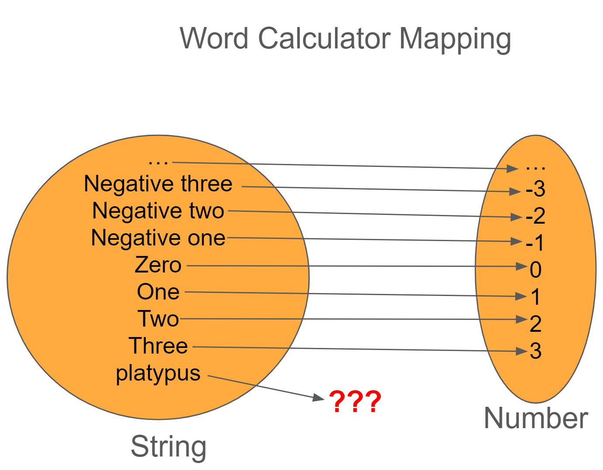
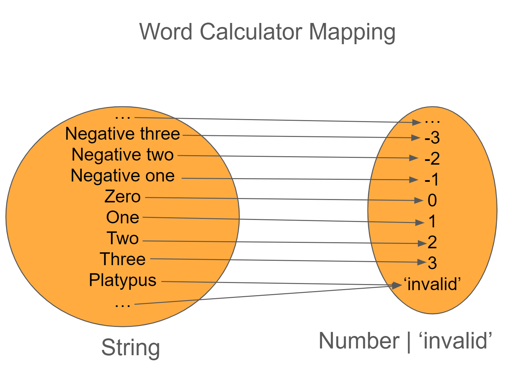
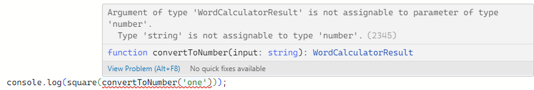

# Functional Design Patterns - Missing Values

When working in software, a common problem that we run into is what should we do if we can't get a value or compute an answer.

For example, let's say that you go to the library to checkout the latest book from [Nathalia Holt](https://www.nathaliaholt.com/), but when you search for it, you realize that they don't have any copies in stock.

How do you handle the absence of value? From an Object Oriented Programming (OOP), you might be able to leverage a reasonable default or the [Null Object Pattern](). Another approach would be to return to always return a list and if there are no values, then the list would be empty.

No matter the choice you make, we need some way to model the lack of a value. [Tony Hoare referred to null as his billion dollar mistake](https://en.wikipedia.org/wiki/Tony_Hoare) as its inclusion in languages have created countless bugs and errors.

In most functional languages, the idea of `null` doesn't exist, so how do they handle missing values?


## Revisiting Functions

In [a previous post](./fp-function.md#what-is-a-function), we mention that a function is a mapping between two sets such that every element on the left (first set) is mapped to a single element on the right (the second set). So what happens when we have a mapping that's not a function?

In these cases, we have two solutions to choose from:

1. Restrict the function input to only be values that can be mapped (e.g., restrict the domain)
1. Expand the possible values that the function can map to (e.g., expand the range)

When refactoring a mapping, I tend to stick with option 1 because if we can prevent bad data from being created or passed in, that's less error handling that needs to be written and it becomes simpler to reason about. However, there are plenty of times where our type system (or business rules) can't enforce the valid inputs.

## Number Math

Let's say that we're working on a "word calculator" where the user can enter a phrase like "one thousand twelve" and it returns "1012" as output. If we think about our input set (domain) and outputs, we would have the following (mapping from string to number).

{width=750px}

The issue is that we can't guarantee that the strings the user gives us would represent a number (for example, how would you convert "platypus" to a number?)

Since we can't restrict the input, we have to expand the output. So let's update our output to be `number | 'invalid'` 

{width=750px}

With this change, anytime we call `convertToNumber`, we'll need to add some handling on what to do if the output is `invalid`. 

Here's some pseudocode of what this mapping could look like

```ts
type WordCalculatorResult = number | 'invalid'

function convertToNumber(phrase:string): WorldCalculatorResult {
    if (phrase === 'one') return 1;
    if (phrase === 'two') return 2;
    // ... other logic
    return 'invalid';
}

console.log(convertToNumber('one')); // prints "1";
console.log(convertToNumber('kumquats')) // prints invalid
```

## Leaky Context

So far, so good as we have a _function_ that converts words to numbers. Let's now say that we want to square a number. Writing such a function is straightforward.

```ts
function square (x:number): number {
    return x*x;
}
```

With both `convertToNumber` and `square` defined, let's try to combine these together: 



This doesn't work because `convertToNumber` can return `invalid` which there's no way for the `square` function to work with that. Due to this limitation, we could rewrite the code to check for `invalid` before calling `square`.

```ts
const result = convertToNumber('one');

if (result !== 'invalid') {
    console.log(square(result));
}
```

This approach will work, but the downside is that we need to add error handling logic in our pipeline now. If this was the only place where it's being used, then it's not too bad. However, if we were using `convertToNumber` in multiple places, then we have to remember to add this error handling logic. In fact, we would have almost the same `if` check everywhere.

Let's take a look at a different way of solving this problem by using the Maybe type.

## Introducing the Maybe Type

In our original approach, we already had a type called `WordCalculatorResult` for the computation. Instead of it being a number or `invalid`, we could instead create a new type, called `Maybe` that looks like the following:

```ts
type Maybe<T> = { label: 'some', value: T } | { label: 'none' }
```

By leveraging generics and tagged unions, we have a way to represent a missing value for any type. With this new definition, we can rewrite the `convertToNumber` function to use the Maybe type.

```ts
function convertToNumber(phrase:string): Maybe<number> {
    if (phrase === 'one') return {label:'some', value:1};
    if (phrase === 'two') return {label:'some', value:2};
    // other logic
    return {label:'none'};
}
```

I don't know about you, but typing out `{label:'some'}` is going to get tiring, so let's create two helper functions, `some` and `none` that handle putting the right label if we have a value or not.

```ts
function some<T>(value:T): Maybe<T> {
    return {label:'some', value};
}

function none<T>(): Maybe<T> {
    return {label:'none'};
}
```

Which allows us to replace all of the `{label:'some', value:x}` with `some(x)` and `{label:'none'}` with `none()`.

```ts
function convertToNumber(phrase:string): Maybe<number> {
    if (phrase === 'one') return some(1);
    if (phrase === 'two') return some(2);
    // other logic
    return none();
}
```

Now that `convertToNumber` returns a Maybe, our pipeline would look like the following:

```ts
const result = convertToNumber('one');

if (result.label === 'some') { // checking if we're a Some type
    console.log(square(result.value));
}
```

## Introducing Transformations With Map

Now the problem we're wanting to solve is to get rid of having to do an if check on `some` in order to call the `square` function. Given that we're wanting to transform our number into a different number, we can write another function, called `map` that takes two parameters: the `Maybe` we want transformed and the function that knows how to transform it. Let's take a look at how to write such a function.

```ts
function map<T,U>(m:Maybe<T>, f:(t:T)=>U): Maybe<U> {
    if (m.label === 'some') { // Is Maybe a Some?
        const transformedValue = f(m.value); // Grab the value and transform it by calling function f
        return some(transformedValue) // return a new Maybe with the transformed value
    }
    return none(); // Return none since there's no value to transform
}
```

With `map` implemented, let's update our code to use it!

```ts
const convertResult = convertToNumber('one'); // 
const transformedResult = map(convertResult, square);

if (transformedResult.label === 'some') { // checking if we're a Some type
    console.log(transformedResult.value);
}

/* The above could be simplified as the following
const result = map(convertToNumber('one'), square);
if (result.label === 'some') {
  console.log(result.value)
}
*/
```

Thanks to `map` and `Maybe`, we're able to write two pure functions (`convertToNumber` and `square`), glue them together, and delegate our error handling to one spot (instead of having to sprinkle this throughout the codebase). 

## Calling Side Affects Using Tee

With the addition of `map`, we've now simplified our `if` check to only call `console.log` now (instead of calling the square function then console.log). If we wanted to truly get rid of this if statement, then we need a way to invoke the `console.log` as a side effect. We don't want to combine `console.log` into `square` because `square` is business rules and we don't want to add side effect logic to our business rules.

Similar to what we did for `map`, let's add a new function, called `tee`, that takes in three arguments: a `Maybe`, a function to call if the `Maybe` has a value, and then a function to call if `Maybe` doesn't have a value.

Let's take a look at what an implementation would look like:

```ts
/*
 Inputs:
    m: A Maybe to work with
    ifSome: A function that takes in a T (which comes from the Maybe) and returns void
    ifNone: A function that takes no inputs and returns void
 Outputs:
    Returns m so that we can continue chaining calls
*/
function tee<T>(m:Maybe<T>, ifSome:(t:T)=>void, ifNone:()=>void): Maybe<T> {
    if (m.label === 'some') {
        ifSome(m.value);
    } else {
        ifNone();
    }
    return m;
}
```

With `tee` implemented, we can update our pipeline to take advantage of it:

```ts
const convertResult = convertToNumber('one'); // 
const transformedResult = map(convertResult, square);

const ifSome = (t:number) => console.log(`Result is ${t}`);
const ifNone = () => console.log('Failed to calculate result.');

tee(transformedResult, ifSome, ifNone);

// if we wanted to get rid of the temp values, we could do the following
// const result = tee(map(convertToNumber('one'), square)), ifSome, ifNone);

```

## Cleaning Up by using an Object

We've now centralized the `if` logic to the functions that work on `Maybe`s which is helpful, but as we're already seeing, the code can be hard to parse as you need to read from the outside in (which is very Clojure or Scheme in nature).

Instead of building up functions this way, we can instead create a TypeScript class and use a [`fluent interface` pattern](https://en.wikipedia.org/wiki/Fluent_interface#Examples) by doing the following:

```ts
export class Maybe<T>
{
  private constructor(private readonly value:T|undefined=undefined){}
  map<U>(f:(t:T)=>U): Maybe<U> {
    return this.value !== undefined ? Maybe.some(f(this.value)) : Maybe.none();
  }
  tee(ifSome:(t:T)=>void, ifNone:()=>void) {
    if (this.value !== undefined) {
      ifSome(this.value);
    } else {
      ifNone();
    }
    return this;
  }
  static some<T>(value:T): Maybe<T> {
    return new Maybe(value);
  }
  static none<T>(): Maybe<T> {
    return new Maybe();
  }
}
// Defined in index.ts
function convertToNumber(phrase:string): Maybe<number> {
    if (phrase === 'one') return Maybe.some(1);
    if (phrase === 'two') return Maybe.some(2);
    // other logic
    return Maybe.none();
}

function square(x:number): number {
    return x*x;
}

// By using the fluent interface pattern, we can chain methods together and have this code read
// more naturally
convertToNumber("one")
  .map(square)
  .tee(
    (v)=> `Answer is ${v}`, 
    () => "Unable to calculate result"
  );

```

## Wrapping Up

When writing software, a common problem we run into is what to do when we can't calculate a value or a result. In this post, we looked at techniques to restrict the function's input or expand their output to handle scenarios. From there, we looked into a type called Maybe and how it can represent the absence of value, but still provide a way to remove having to explicitly write error handling code by consolidating the checks into a `map` call. Lastly, we look into taking the various functions that we wrote and combine them into a formal `Maybe` class that allows us to leverage a fluent interface and chain our interactions together.