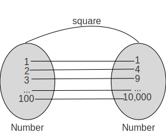
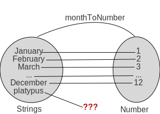
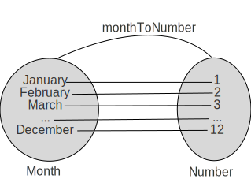
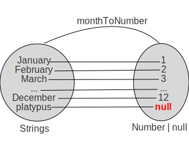

# Functional Design Patterns - Building Better Functions

In this post, we're going to take a look at a core concept of functional programming, the _function_. From here, we'll explore what a good function looks like and a couple of strategies to turn a bad function into a good function.

First off, what is a function? In math terms, a _function_ is a mapping between two sets such that an element in the first set is mapped to a single element in the second set.

What does this mean for software development? In our case, a _function_ is a mapping between two _types_ where an element in the first _type_ maps to a single element in the second _type_.

Let's say that we have the following code for squaring a number:

```ts
const square = (x:number):number => x*x;
```

This function takes a _number_ (the first type) and returns a _number_ (the second type). 

To determine if this is a good function, we need to see if there's any input (e.g. a number) that when passed to the `square` function, it wouldn't return a number.

We can do this by drawing out a mapping diagram as so

<figure markdown>
  { width="600" }
  <figcaption>Mapping Between Number and Number using the square function</figcaption>
</figure>

Since every number is mapped to a single number, this mapping is a function, hooray!

## When Functions Go Bad

However, not all mappings are functions. Let's take a look a this example where we're trying to convert a month to it's numeric form:

```ts
const monthToNumber = (month:string): number => {
  switch (month?.toLowerCase().trim()) {
    case 'january': return 1;
    case 'february': return 2;
    case 'march': return 3;
    //omitting other months for brevity
    case 'december': return 12;
    default: throw new Error("can't parse to number");
  }
}
```

Is this mapping a function? Can every element the _string_ type be mapped to a _number_? Nope! In fact, if we pass in `'platypus'`, the function returns an error, not a number at all!

<figure markdown>
  
  <figcaption>Mapping Between String and Number using the monthToNumber function</figcaption>
</figure>

This is an issue because if we don't have a good function, we can't leverage other functional programming principles (for example, can't compose this function with anything else because we don't always get a number back).

Additionally, this becomes harder to debug/troubleshoot because the type signature says that we get a number, but it's not true, we will get a number _sometimes_ and it's this _sometimes_ that makes things messy.

So what can we do in this situation?

When we find this problem, we have two options to fix it

1. Restrict the inputs
2. Expand the range

Let's take a look at both of these approaches

## Restricting the Input

The heart of the problem in this case is that the function accepts any _string_ as input, however, only certain strings are allowed.

Let's create a new type that only contains these strings

```ts
type Month = 'January' | 'February' | 'March' | 'April' |
             'May' | 'June' | 'July' | 'August' |
             'September' | 'October' | 'November' | 'December'
```

With this new type, we can update our function to look like this:

```ts
const monthToNumber = (month:Month): number => {
  switch (month) {
    case 'January': return 1;
    case 'February': return 2;
    case 'March': return 3;
    //omitting other months for brevity
    case 'December': return 12;
  }
}
```

Which gives us a new mapping of:

<figure markdown>
  
  <figcaption>Mapping Between Month and Number using the monthToNumber function</figcaption>
</figure>

By changing the input type from _string_ to _Month_, we were able to remove the default case and the string manipulating functions (`toLower` and `trim`).

When possible, I prefer the input restriction approach as it simplifies the amount of error handling code that needs to be written and it ensures that callers of this function doesn't have to deal with the weird outputs.

However, this approach has trade-offs. In this case, we were able to define a new type to restrict the input. But what if we couldn't do that? What if we had to handle all possible strings?

## Expanding the Range

When we can't restrict the inputs, we have to expand what the return types are. Typescript allows us to use `union` types. So one approach could be changing the return type to be `number` or `null`

```ts
const monthToNumber = (month:string): number|null => {
  switch (month?.toLowerCase()) {
    case 'january': return 1;
    case 'february': return 2;
    case 'march': return 3;
    //omitting other months for brevity
    case 'december': return 12;
    default: return null;
  }
}
```

Which gives us a mapping of:

<figure markdown>
  
  <figcaption>Mapping Between String and Number or null using the monthToNumber function</figcaption>
</figure>

One advantage of this approach is that we're signaling to callers of this function that you could get a `number` or `null` so you need to handle both those cases

```ts
// result is number or null, so we need to handle both cases
const result = monthToNumber('January');
if (!result) {
  console.log('input invalid');
} else{
  console.log(result);
}
```

The main downside to this approach is that you now need to sprinkle `if (!result)` checks anywhere that's using `monthToNumber`. That being said, TypeScript will prompt you that you need to handle this condition, so we can lean on the compiler to keep us honest.

## Wrapping Up

In this post, we explored what we meant by a _function_ and what properties that a function has to follow. From there, we looked at various functions, checking if they were valid or not. Finally, we learned about our choices for taking an invalid function and making it valid by either restricting its inputs or by expanding the outputs.
