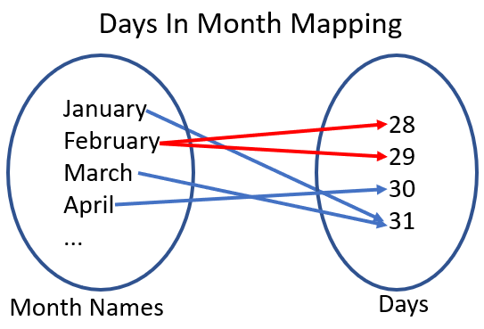
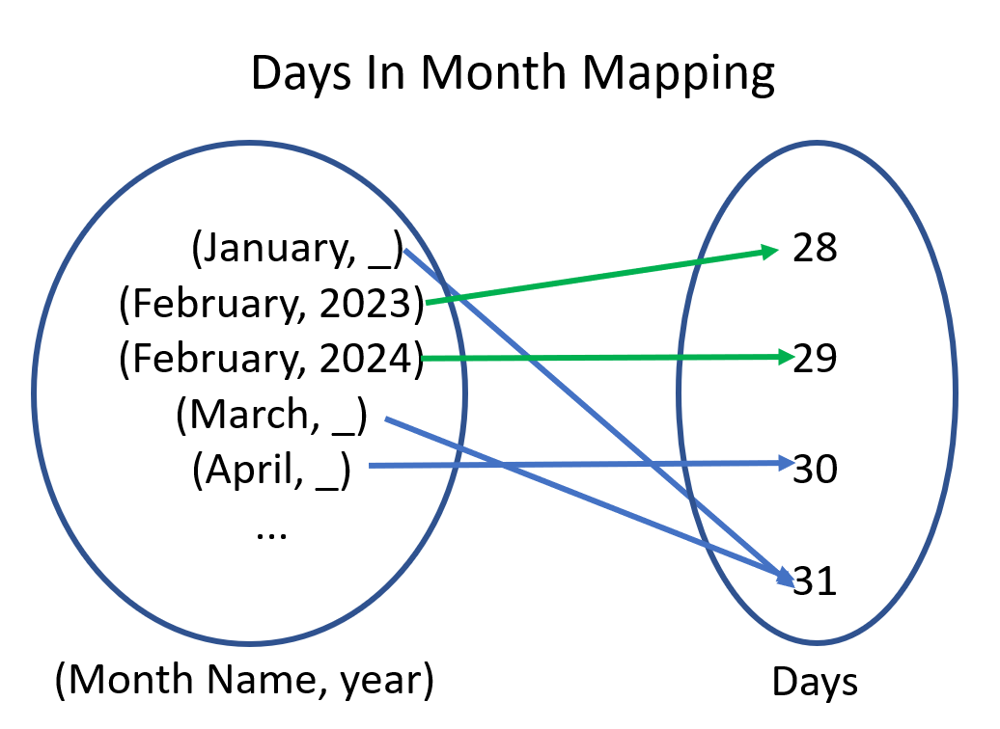

# The Humble Function - Foundation to Functional Programming

When learning about functional programming, you won't go far before you run into the concept of a _function_. But we're not talking about some syntax or keywords in the language, but from a mathematical sense.

!!! info ""
    A function is a mapping between two sets such that for every element in the first set, it's mapped to a single element in the second set.

Since a _set_ is a collection of _elements_, this is similar to a _type_ where _values_ are part of that type. With this understanding, we can modify our definition of a function to be:

!!! info ""
    A function is a mapping between two _types_ such that for every _value_ in the first type, it's mapped to a single value in the second type.

## So What Does a Function Look Like?

Before diving into code, let's build up our understanding of functions more. When drawing out the function, we can model it like this.

<figure markdown>
{width="500"}
<figcaption>Generic mapping from A to B</figcaption>
</figure>

The first type (A) is a circle where each possible value is listed, using `...` to denote a pattern. The arrows map from each value of A to a value in B.

With this example, we know we have a function if the mapping satisfies the following rule:

_Every element on the left maps to a single element on the right._

This rule seems easy enough to follow, but let's look at a mapping where this rule doesn't hold.

### Functional Heartbreak

Let's say that we needed to write some code that could take a given month and return the number of days it has. Given this, here's what the mapping would look like.

<figure markdown>
{width="500"}
<figcaption>Mapping from month name to days in month</figcaption>
</figure>

To check if we have a function, we need to see if there's any element on the left with two or more arrows coming out. 

In this case, February is breaking our rule because it could map to 28 _or_ 29, depending on if it's a leap year. Since there isn't a parameter to denote if it's a leap year, our mapping isn't consistent and can't be a function.

One way to fix this would be to change our type on the left from _MonthName_ to _MonthName_ and _year_. Making this change gives us this new mapping.

<figure markdown>
{width="500"}
<figcaption>Month and year mapping to days in month</figcaption>
</figure>


### Hip to Be Square

Let's look at a mapping that is a function, the square function.

<figure markdown>
{width="500"}
<figcaption>Square mapping from number to number</figcaption>
</figure>

_Does every value on the left map to a single value on the right?_ 

Yep, every value does. In fact, there are some values on the left that map to the same value on the right, which isn't a problem.

If we wanted to, we could restrict the type on the right from _number_ to _non-negative number_, but there's no harm in having it be wider than needed.

## Kinds of Functions

With this understanding of functions, let's talk about the two kinds of functions we can write and how they interact with each other.

### Pure Functions
First, we have the _pure_ function. These functions depend wholly on their inputs and they do not interact with outside state. For example, pure functions won't interact with databases, file systems, random generation, or time. 

Pure functions are great because they're easy to test, composed with other functions, and don't modify state. Another advantage is that pure functions can be replaced with the result of their call (in other words, you could replace a call to `square(3)` with its result, `9` and the program is the same). This is known as [referential transparency](https://en.wikipedia.org/wiki/Referential_transparency) and is a great tool for troubleshooting an application. 

The main downside to pure functions is that since they don't talk to other systems (including input/output), it's impossible to write a useful program with just pure functions.

### Impure Functions
Impure functions, on the other hand, focus on interacting with outside state. These functions will call to the database or other systems, get the time, and generate random data as needed. 

They allow us to write useful programs because they interact with input/output, however, the trade off is that they can be harder to test, they don't compose, and since they modify state, you may not be able to run them multiple times and get the same result.

One way to identify an impure function is by looking at its type signatures. For example, a function that takes inputs but returns `void` has to be modifying state or talking to another system, otherwise, why would you call it? Another signature is a function that takes no inputs, but it can return a value (like `readLine()` from nodejs), where did it get the value from? Just short of returning a constant value, it had to get it from somewhere.

## Building an Application

Building an application requires both _pure_ and _impure_ functions, but how do we leverage the best of both worlds?

When I think about software, I think about how data flows through the system. For example, if someone is using a console application, they're inputting their commands to the terminal, which in turn converts them to commands to run, where the output is displayed on the screen.

As such, an application is made of three kinds of functions.

- Boundary functions - These are responsible for getting input/output. They should have zero business rules (or the least possible as they are impure functions.
- Business functions - These are the business specific rules that need to be ran on the given inputs. As these are typically the most important of an application, they are designed as pure functions
- Workflow functions - This is the combination of boundary components and business components to build something useful. Since they're using impure functions, this will also be impure, but I often use this as my [composition root](https://blog.ploeh.dk/2011/07/28/CompositionRoot/) for the application.


## Effervescent Applications with Fizz Buzz

To demonstrate, let's build a version of [FizzBuzz](https://en.wikipedia.org/wiki/Fizz_buzz#Programming) that uses this mindset.

For the problem, we have the following requirements.

- If the number is divisible by 3, print "Fizz".
- If the number is divisible by 5, print "Buzz".
- If the number is divisible by both 3 and 5, print "FizzBuzz".
- If the number isn't divisible by any of these, then print the number.

Given that we're building a console application, we will need to support getting input via the console and printing to the console.

Let's go ahead and build up our boundary functions.

```ts
// Impure function that allows us to get number from user
function getInput(): number {
  // using prompt-sync https://github.com/heapwolf/prompt-sync
  const prompt = require("prompt-sync")({ sigint: true });
  const response = prompt("What number to calculate FizzBuzz to?");
  if (!(+response) || (+response)<1) {
    console.log('Invalid response, please enter a positive number greater than 1');
    return getInput();
  }
  return +response;
}

// Function that wraps console.log for printing
function printOutput(content:string): void {
  console.log(content);
}
```

At this point, we have a way of getting a number via `getInput` and a way to print a string via `printOutput`. In `printOutput`, this is a tiny function with no business rules whatsoever. `getInput`, however, has some business rules about validation, but we'll see later on how to refactor this.

For now, let's leave these two and look into creating our business rule functions.

```ts
// Business rules for FizzBuzz
function calculateFizzBuzz(input:number): string {
  if (input % 3 == 0 && input % 5 == 0) {
    return "FizzBuzz";
  }
  if (input % 3 == 0) {
    return "Fizz";
  }
  if (input % 5 == 0) {
    return "Buzz";
  }
  return `${input}`;
}

// Helper function to create a range of numbers from [1..end]
function createRangeFromOneTo(end:number): number[] {
  if (number < 1) {
    return [];
  }
  return Array.from(Array[number].keys()).map((x)=>x+1);
}

```

With `calculateFizzBuzz` defined, we could write unit tests to ensure the correctness of the behavior. We could also create a mapping to double-check that we have a function.

Now, let's revisit our `getInput` function. We've got some business rules that deal with validation (e.g. the input must be a number and greater than 1). Given that this is a light business rule, we could leave it here; however, testing this becomes harder because we don't have a way to ensure that the validation works as expected.

To solve this problem, we could extract the validation logic to its own pure function and update `getInput` to use the new function.

```ts hl_lines="12"
function isInputValid(input:string): boolean {
  if (!(+input)) {
    return false;
  }
  return (+input) > 1;
}

function getInput(): number {
  // using prompt-sync https://github.com/heapwolf/prompt-sync
  const prompt = require("prompt-sync")({ sigint: true });
  const response = prompt("What number to calculate FizzBuzz to?");
  if (!isInputValid(response)) {
    console.log('Invalid response, please enter a positive number greater than 1');
    return getInput();
  }
  return +response;
}
```

Nice! With this in place, we can go ahead and implement our last function, the FizzBuzz workflow.

```ts
function runFizzBuzzWorkflow (): void {
  // Data coming in
  const maximumNumber = getInput();

  // Calculating results
  const results = createRangeFromOneTo(maximumNumber).map((x)=>calculateFizzBuzz(x));

  // Print Results
  results.forEach((x)=>printOutput(x));
}

// example invocation
runFizzBuzzWorkflow();
```

This is a straightforward implementation as we get the `maximumNumber` to calculate, create an array of numbers from 1 to `maximumNumber`, map each of those to their FizzBuzz representation, and then print them to the screen.

Let's go one step forward. In our example, we assumed that the input and output was coming from the console, but what if we needed to change to read and write to a file?

We could move the boundary functions to be parameters to `runFizzBuzzWorkflow`, let's take a look at what that would give us.

```ts
function runFizzBuzzWorkflow (readInput:()=>number, writeOutput:(string)=>void){
    // Data coming in
  const maximumNumber = readInput();

  // Calculating results
  const results = createRangeFromOneTo(maximumNumber).map((x)=>calculateFizzBuzz(x));

  // Print Results
  results.forEach((x)=>writeOutput(x));
}

// example invocations
runFizzBuzzWorkflow(getInput, printOutput); // using console read/write
runFizzBuzzWorkflow(()=>42, printOutput); // using hardcoded input with console log
```

With this change, we can now swap out how we can input or output by creating new functions with the right type signatures. This makes testing workflow components easy because you can stub in your own mocks (no need for mocking frameworks).

If you understand the power of switching out your boundaries, then you also understand other modern architectures like [Ports and Adapters](https://en.wikipedia.org/wiki/Hexagonal_architecture_(software)) as they follow a similar principle.

## Wrapping Up

In this post, we looked at what a _function_ is, how it relates to types, and how to tell if a mapping is a function. From there, we covered the differences between pure and impure functions and how you need both to build any useful application. Finally, we wrapped up by implementing the FizzBuzz problem using this approach.
