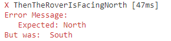
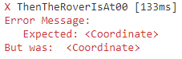

# Mars Rover – Implementing Rover : Creation

In this installment of the Mars Rover kata, we’re going to start implementing the `Rover` type! First, we’re going to review the models that we derived in Part 2 of the series. From there, we’ll take a look at the various requirements and see which piece to start implementing. From there, we’ll write our first tests, driving the new functionality and running into a snag or two on the way. By the end of this post, we’ll be one requirement down for the kata and have a better understanding of the `Rover` type!

## Model Review

As a recap, we’ve derived the following [models and implementations](./mars-rover-modeling.md) for the kata so far. For this post, we’re going to be spending the majority of our time working with `Rover`, but it’s good to know what our base looks like.

```csharp
public enum Command
{
  MoveForward, MoveBackward,
  TurnLeft, TurnRight,
  Quit
}
```

```csharp
public enum Direction
{
  North, South, East, West
}
```

```csharp
public class Coordinate
{
  public int X {get; set;}
  public int Y {get; set;}
}
```

```csharp
public class Rover
{
  public Direction Orientation {get; set;}
  public Coordinate Location {get; set;}
}
```

With this in mind, let’s start working on adding some new functionality to `Rover`!

## In the beginning

### Picking an Approach

When I begin a new feature, one thing that I’m always thinking about is how do I break down the work ahead of me in such a way that I can start delivering value much faster. This doesn’t mean that I’m skipping on quality, but it does mean that I value quicker feedback than 100% test coverage. With that being said, when I look at the [requirements](./mars-rover-definition.md#problem-description), something that I can implement pretty quickly is that when the `Rover` starts, it should be at (0, 0) facing North.

Like everything in development, there are multiple ways we could implement this functionality

1. Provide a default constructor for `Rover` that sets those values explicitly
2. Update the Program.cs file to set those values for `Rover`

With the first approach, we’re encoding this business rule into the `Rover` type and forcing that when anyone creates an instance of `Rover`, it will always be at (0, 0) facing North which is a nice way of putting the business rule into the right component. 

With the second approach, we’re going to let `Rover` be a dumb component and have some other component decide these values. The downside to this approach is that if there’s an error with `Rover`, we won’t know if it’s because of how `Rover` is behaving or how it was created. 

Both approaches are valid, so I’m just going to pick one and use that for now. If later down the road we need to make a change, we’ll update as needed. With that being said, I’m leaning towards the first approach, so let’s go ahead and write our first unit test on making sure that `Rover` is facing `North`.

### Gaining Our Bearings

Creating a unit test for `Rover` where the `Orientation` should be `North` would look like the following:

```csharp
[Test]
public void ThenTheRoverIsFacingNorth()
{
  // Arrange and Act
  var rover = new Rover();
  
  // Assert
  Assert.AreEqual(Direction.North, rover.Orientation);
}
```

What’s interesting here is that when we run this test, it passes! But why does it pass? If we look back at `Rover`, here’s how we’ve defined it.

```csharp
public class Rover
{
  public Direction Orientation {get; set;}
  public Coordinate Location {get; set;}
}
```

We don’t have any constructors defined nor are we setting values for the two properties, so how does it know that `Orientation` is `North`? 

Magic?

Not quite! Since we’re not setting any value for `Orientation`, it will be whatever the default value for `Direction` is. We can determine that by using the [default](https://docs.microsoft.com/en-us/dotnet/csharp/language-reference/operators/default) operator in C#.

```csharp
default(Direction); // North
```

But why is `North` the default value for `Direction`?

If you remember how `Direction` was defined, we decided to define it as an _enum_ which is really a number in disguise.

```csharp
public enum Direction
{
  North, South, East, West
}
```

So what’s the default value for a number?

```csharp
default(int); // 0
```

So what’s happening here is that when the `Rover` is created, it looks for any logic in the default constructor. Since there isn’t one, it will set default values to both properties. For `Orientation`, that value will be 0 and by default, it will be the first value listed in the `Direction` enum.

So for fun, if we change `North` to be the second choice in `Direction`

```csharp
public Direction
{
  South, North, East, West
}
```

then our test fails with our expected error.

<figure markdown>
  
  <figcaption>Failing unit test for Mars Rover as the expected value was North, but the value was South.</figcaption>
</figure> 

I don’t know about you, but someone changing the ordering of an _enum_ shouldn’t be causing a failing test. Luckily, resolving this issue is as simple as explicitly stating the `Orientation` in `Rover`‘s default constructor.

```csharp
public class Rover
{
  public Direction Orientation {get; set;}
  public Coordinate Location {get; set;}
  
  public Rover()
  {
    Orientation = Direction.North;
  }
}
```

Now, our test passes even if we change the ordering of values in `Direction`!

### Getting to Ground Zero

Now that we have our `Orientation` figured out, let’s go ahead and write our next test to make sure that the `Location` is correct.

```csharp
[Test]
public void ThenTheRoverIsAt00()
{
  // Arrange and Act
  var rover = new Rover();
  
  var expectedLocation = new Coordinate{X=0, Y=0};
  Assert.AreEqual(expectedLocation, rover.Location); 
}
```

When we run the test, we get the following error:

<figure markdown>
  
  <figcaption>Failed test for Rover since it was expecting a Coordinate, but the Location was null.</figcaption>
</figure> 

Ah, yeah, that makes sense, `Location` is a `Coordinate` which is an object. Because we’ve not explicitly set `Location`, the default value is `null`.

```csharp
default(Coordinate); // null
```

So let’s go ahead and update the `Rover` constructor

```csharp
public class Rover
{
  public Direction Orientation {get; set;}
  public Coordinate Location {get; set;}
  
  public Rover()
  {
    Orientation = Direction.North;
    Location = new Coordinate(){X=0, Y=0};
  }
}
````

So let’s re-run our test now.

```csharp
[Test]
public void ThenTheRoverIsAt00()
{
  // Arrange and Act
  var rover = new Rover();
  
  var expectedLocation = new Coordinate{X=0, Y=0};
  Assert.AreEqual(expectedLocation, rover.Location); 
}
```

<figure markdown>
  
  <figcaption>Failed unit test since the expected coordinate is not the same as the actual coordinate..</figcaption>
</figure> 

What’s going on here?

### Not All Locations Are Created Equally

When we leverage `Assert.AreEqual`, under the hood, it’s leveraging the built-in `Equals` method for the values being passed in. For primitive types, this will do a comparison by _values_, but if we’re comparing objects, then it will do comparison by _reference_. 

Given this, the problem we’re running into now is that even though I have two `Coordinate`s that have the same value, since they are two different objects, then `Assert.AreEqual` will fail. We’ve got a couple of different ways to solve this problem.

#### Overriding the `Equals` Method

One way to solve the problem is by overriding the `Equals` method on the `Coordinate` class and override the logic so that two `Coordinate`s are the same if all of their properties are the same. This is a pretty solid approach to take if that’s how equality should work everywhere. With that being said, here are some things to keep in mind when using this technique.

First, if the class gains a new property, you will need to remember to update the `Equals` method, otherwise, you’ll get interesting behavior when two objects that have a single difference are being treated as the same.

Next, if you override `Equals`, [then you must override GetHashCode as well](https://docs.microsoft.com/en-us/dotnet/api/system.object.gethashcode?view=netcore-3.1#remarks). If you fail to do this, this will generate a warning during compilation time, but the bigger problem is that for two objects that are the same based on the definition of `Equals` but hash differently, then you will fail to find the item correctly in `Dictionary` and `HashSet` structures. When implementing `GetHashCode`, you should use the same properties for hashing as you would for equality checking. 

Overall, I will use this approach if equality for this type needs to be by value for everywhere in the application but this isn’t my favorite approach because developers need to remember to update both `Equals` and `GetHashCode` when new properties are added.

#### Going from `class` to `struct`

The second approach we can take to have equality by value is by changing our type for `Coordinate` from a `class` to a `struct`. The cool thing about `structs` is that they by default handle equality by value so if you do need to add another property, things will work as expected. However, like all things in software, there are a couple of things to be aware of.

First, `structs` have to have an empty, default constructor. So if there are some validation rules that need to be checked in the constructor, there’s no way to force that to happen. Another effect of this drawback is that if a `struct` needs two things to exist or it shouldn’t be created, you can’t force callers to pass them in which can play havoc with making illegal states unrepresentable.

Second, when working with `struct`s, and you change one of the properties, you’re modifying a _copy_ of the struct and not the original version.

```csharp
public struct Date
{
  public int Month {get; set;}
  public int Day {get; set;}
  public int Year {get; set;}
}

public class Order
{
  public Date TransactionDate {get; set;}
  public decimal Total {get; set;}
}

var order = new Order{Total=9.99m}; // at this point, Order will have a Date of 0/00/0000
order.TransactionDate = new Date{Month=6, Day=22, Year=2020}; // Order has a new date!
order.TransactionDate.Day = 23 // Fail to compile => Cannot modify the return value of `TransactionDate`
                              // because it is not a variable
```

It’s not a problem if you replace the _whole_ struct value, but if you only want to change a part of it, you’ll need to replace the whole value. If you’ve ever worked with the `DateTime` type, you’ll notice that you can’t change values, but you can create a new `DateTime` value with updated properties.

Overall, I prefer this approach when modeling values where dependencies aren’t required and there’s not a need for validation logic.

#### Creating an `Equals` Method for Testing

The third approach you can take when checking if things are equal is by defining a custom `Equals` method that lives in my test suite and is only used for testing. The benefit of this approach is that I can now verify my objects by value, without the need of overriding two different methods. In addition, since this type of equality is only needed for testing, I can now have this logic live in the test project. In addition, I can still have validation logic and non-default constructors for my classes.

The main downside to this approach is that if there’s a new property added to the class that you’ve written custom equality logic for, you’ll need to update this method as well.

Overall, I prefer this approach when I need equality by value for testing purposes only and I don’t want to make wide-sweeping changes by changing my type from `class` to `struct`.

### Making Locations Equal

Now that we have some more information about why the test failed and a few different approaches, let’s take a look at what approach makes sense here. First off, `Coordinate`s really don’t have any validation logic. Second, in our system, if we have two `Coordinate`s with the same values, then they should be considered the same. Given these assumptions, I’m going to go ahead and change the type definition from `class` to `struct`.

```csharp
public struct Coordinate
{
  public int X {get; set;}
  public int Y {get; set;}
}
```

Now that we’ve made that change, if we re-run our test, it passes!

### Wrapping Up

In this post, we started writing tests on `Rover`. We started off by adding a default constructor which sets the `Orientation` to `Direction.North` and explored about how setting defaults explicitly can protect us from changes in the future. From there, we wrote a test on `Location` and learned about how `Assert.AreEquals` leverages default equality and a few different approaches to solving this problem. Now that we have a way to assert against `Orientation` and `Location`, we can start writing tests for when the rover moves forward!
