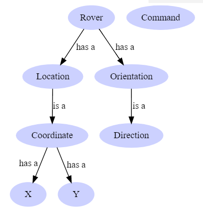

# Mars Rover - Modeling Concepts

In the last post, we took a look at the problem description for Mars Rover and developed a set of concepts for the problem. From these concepts, we were able to develop common terminology and determine the relationships between the concepts. In this post, I’m going to show how I think about software design in general and how to apply them when modeling in code.

As a note, I’ll be showing code in both C# (for Object-Oriented approaches) and F# (for Functional Programming approaches). Once again, these concepts are fundamentals, but depending on your technology stack, the implementations will vary.

## Design Guidelines

When I’m designing my models, my end goal is to produce software that captures the problem at hand using the same terms that the business uses. By striving for this goal, I can have richer conversations with my stakeholders when I run into interesting interactions of various business rules and can speak to them using the right terminology. In addition to capturing the problem, I will focus on designing my models in such a way that a developer can’t violate a business rule because the code won’t compile. At this point, I would have made illegal states unrepresentable in my code.

I first came across this term while reading Scott Wlashcin‘s work on the terrific F# for Fun and Profit website and it immediately resonated with me. I’ve definitely been bitten before working in a codebase where I wrote some code that compiled but blew up in my face during runtime because the parameter I passed in wasn’t valid for the method I was calling. Wouldn’t it be nice if the compiler told me while I was writing the code that what I was doing wouldn’t work? By thinking a bit more about the models being used and what some of their properties are, we can make this goal achievable.

## Modeling Types

With these goals in mind, when it comes to modeling concepts, I naturally gravitate to types and find that types will fall in one of three categories.

### The Type Has a Finite Number of Values

If the type has a finite number of valid values, then we can remove error conditions by defining the type to only be one of those possible options. For those from an Object-Oriented background, _enums_ are a great example of modeling these types as you can explicitly set a label for the different values. For those from a Functional background, _sum types_ are a great way to model these choices.

Some examples of such a type include the states in the U.S., the suits for a deck of playing cards, or the months in a year.

```csharp
public enum State
{
  Alabama, Alaska, California, Delaware,
  Florida, Georgia, Tennessee, Wyoming
}

public enum Suit
{
  Hearts, Clubs, Spades, Diamonds
}

public enum Months
{
  January, February, March, April, May, June,
  July, August, September, October, November, December
}
```

```fsharp
type State = Alabama  | Alaska  | California
           | Delaware | Florida | Georgia
           | Tennesee | Wyoming
```

### The Type Has an Infinite Number of Values

For other types, however, there are so many possible valid values that it’s impossible to list all of them. For example, if we were looking at valid house numbers for an address, any positive integer would be valid so good luck on defining every positive number as an _enum_ or _sum type_.

In these cases, I will leverage built-in primitives to model the concept at first. So in the case of _HouseNumber_, an integer might be a good enough spot to start. However, if I then find myself writing code that can work on integers, but shouldn’t work on _HouseNumbers_, then I might wrap a stronger type around the integer (see below).

```csharp
// If the value isn't a major component of the design, we can use a primitive type
int houseNumber;

// However, if the type is a major concept to the domain at hand,
// it makes sense to lift it to its own type
public class HouseNumber
{
  public int Value {get;}
  public StreetNumber(int input)
  {
    // validation logic
    Value = input;
  }
}

// The difference between the two approaches is that in the first case, this would work
int houseNumber = 400;
Math.Sqrt(houseNumber);

// But this wouldn't
var houseNumber = new HouseNumber(400);
Math.Sqrt(houseNumber); // fails to compile with "cannot convert from HouseNumber to double"
```

```fsharp
// If the value isn't a major component of the design, we can use a primitive type
let houseNumber:int;

// However, if the type is a major concept to the domain at hand,
// it makes sense to lift it to its own type (single case sum type)
type HouseNumber = HouseNumber of int

// The difference between the two approaches is that in the first case, this would work
let houseNumber = 400;
Math.Sqrt(houseNumber);

// But this wouldn't
let houseNumber = HouseNumber 400
Math.Sqrt(houseNumber); // fails to compile with
                        // "This expression was expected to have type 'float' but here has type 'HouseNumber'"
```

### The Type Is a Composition of Other Types

As the saying goes, large programs are built by composing a bunch of smaller programs, and types are no different. As we begin to model more complicated types, it’s natural to start thinking about types being composed of other types. For these types, we’ll leverage either _objects_ (if following OO) or _records_ (if following FP).

One way you can determine if you’re needing a composite type like this is if you find yourself using the word and or has when describing the type, then it’s a composition. For example:

> An Address has a HouseNumber, it _has_ a StreetName, it _has_ a State.

> An Address consists of a HouseNumber _and_ a StreetName _and_ a State


```csharp
public class Address
{
  public int HouseNumber {get; set;}
  public string StreetName {get; set;}
  public State State {get; set;}
}
```

```fsharp
type Address = {
  houseNumber:int,
  streetName:string,
  state:State
}
```

### Modeling Types
Now that we’ve talked about some different modeling techniques, let’s see how we can apply those rules as we start to model Mars Rover. From the previous post, we were able to derive the following concepts and relationships:

- A _Rover_ has a Location and an Orientation
- _Orientation_ is the _Direction_ that a Rover is facing
- _Location_ is the coordinates that the _Rover_ is located at
- A _Command_ is something that a _Rover_ receives from the User
- A _Direction_ can be North, East, South, or West
- A _Command_ can be Move Forward, Move Backward, Turn Left,  Turn Right, or Quit

Yielding the following graph

<figure markdown>
  
  <figcaption>Domain model relationships where Rover has a Location and an Orientation. Orientation is a Direction and Command is not related to anything.</figcaption>
</figure>

Given the above rules, we can start taking a look at how to model these in code! We’ll first start with the models that don’t have a dependency, and then build up from there

### Modeling Direction

From the above requirements, _Direction_ can only be one of four possible values (North, East, South, West). So based on that, it looks like we can leverage the first rule and model _Direction_ like so:

```csharp
public enum Direction
{
  North, South, East, West
}
```

```fsharp
type Direction = North | East | South | West
```

### Modeling Command

From the above requirements, _Command_ can only be one of five possible values (MoveForward, MoveBackward, TurnLeft, TurnRight, and Quit). Based on that, we can once again leverage the first rule and model _Command_ like so:

```csharp
public enum Command
{
  MoveForward, MoveBackward,
  TurnLeft, TurnRight,
  Quit
}
```

```fsharp
type Command = MoveForward | MoveBackward
             | TurnLeft | TurnRight | Quit
```

### Modeling Location
After talking more with our Subject Matter Expert, a _Location_ is the _Coordinate_ where the Rover is located.

Aha! A new concept!

When we ask additional questions, we find out that a _Coordinate_ refers to the [Cartesian Coordinate System](https://en.wikipedia.org/wiki/Cartesian_coordinate_system#Two_dimensions) and for the problem we’re solving, we can assume that a _Coordinate_ represents two numbers where the first number represents the location from the x-axis and the second number represents the location from the y-axis.

With this new information, our mental model has changed to be the following

<figure markdown>
  
  <figcaption>Domain model relationships where Rover has a Location and an Orientation. Location is a Coordinate where Coordinate has an X and Y value. Orientation is a Direction and Command is not related to anything.</figcaption>
</figure>


Going into further discussion, we find out that both X and Y will be whole numbers for our emulation and that they can be negative. Based on these properties, it sounds like X and Y can be modeled as integers and therefore fall under the second rule.

Given that a Coordinate has to have both an X and Y value, it sounds like _Coordinate_ falls under the third rule and that this concept is a composition of X and Y.

```csharp
public class Coordinate
{
  public int X {get; set;}
  public int Y {get; set;}
}
```
```fsharp
type Coordinate = {x:int; y:int}
```

### Modeling Orientation
From the above requirements, it seems like _Orientation_ is what we call the _Direction_ that the _Rover_ is facing. Based on that, this sounds like a property that _Rover_ would have.

### Modeling Rover
Now that we have both the _Direction_ and _Coordinate_ concepts designed, we can start designing _Rover_. From the requirements, it looks like _Rover_ is a combination of _Direction_ (known as Orientation) and a _Coordinate_ (known as a Location). Based on that, _Rover_ falls under the third rule and looks like the following.

```csharp
public class Rover
{
  public Direction Orientation {get; set;}
  public Coordinate Location {get; set;}
}
```

```fsharp
type Rover = {
  orientation:Direction;
  location:Coordinate;
}
```


## Wrapping Up
In this post, we implemented the basic types needed to solve the Mars Rover kata! We first started by taking a look at the concepts identified earlier and thought about the characteristics of the type which helped guide us to build software that both uses the terms of the problem domain and also prevents us from creating errors by making illegal states unrepresentable. In the next post, we’ll start adding functionality to our application.

## Additional Reading
- [Designing with types: Making illegal states unrepresentable](https://fsharpforfunandprofit.com/posts/designing-with-types-making-illegal-states-unrepresentable/) by Scott Wlaschin
- [Domain Model](https://martinfowler.com/eaaCatalog/domainModel.html) by Martin Fowler