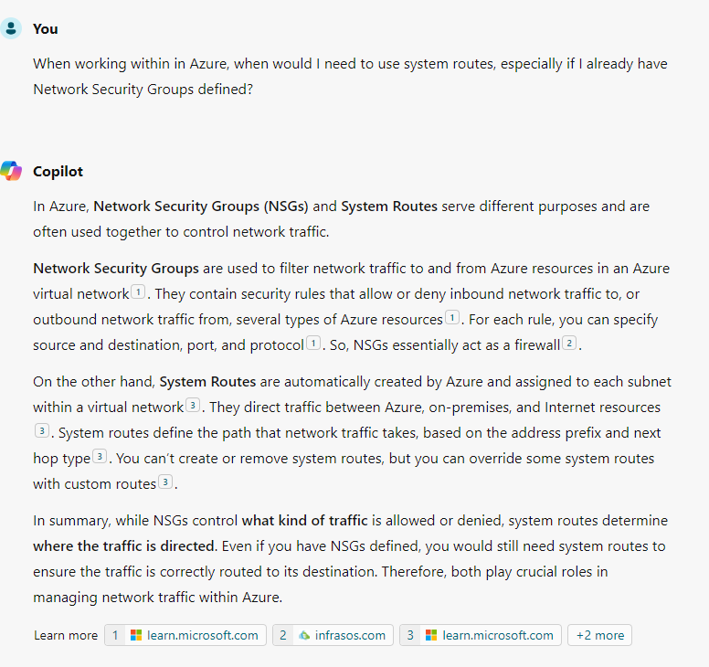

# My Experience Preparing for the Azure Administrator Associate (AZ-104) Exam

There's been a bit of a lull the past couple of weeks on the blog as I've been focusing my time on studying and preparing for the AZ-104 exam. This was a particularly challenging certificate for me as I don't have a traditional IT Admin background so I had to not only shore up the gaps in that knowledge, but then also had to learn how to model similar concepts in Azure.

That being said, I was able to pass the exam on my first take and wanted to share some advice for those who are looking to take this or other Azure exams.

## Expand your studying outside of the Microsoft Learn documentation

The Microsoft Learn docs are fine for doing a deep dive into a subject, but if it's the first time learning a concept, then they can be a bit rough as they assume you have knowledge that you might not. To help round out your learning, I recommend finding other resources like videos, books, or articles.

## Build and Experiment in Azure

Given that most of these concepts are pretty abstract, I found that they stuck with me much more when I build out the resources. For example, when working with a Virtual Machine, all of its components need to be in the same region. You can either remember that text OR you know that has to be true because if you try building out the VM in Azure and try to change components, it's going to fail.

## Don't Rely Solely on Practice Exams

Back in 2019, I was studying/preparing for the 483 (exam on C#) and the advice at the time was to go over the practice exams over and over again until things stuck. Following the same advice, I took tons of practice exams (through MS Learn and MeasureUp) and though they might have had the same format as the exam (multiple choice, drag-and-drop, etc...), none of them were a good stand-in for the real exam.

The reason being is that the exam questions likely won't ask you to define a term, but are more likely to be along the lines of how you'd solve a problem (which expects you to know the terminology inherently). So if you don't have the underlying knowledge, you're going to have a bad time trying to answer the questions.

Where the practice exams shone was helping me identify areas that I needed to focus more on. For example, if I struggled in the Networking section, then I know I needed to revisit concepts there. This helped me make the most of my studying time.

## Using Generative AI To Help Understand Concepts

Given that I don't come from a networking/IT background, there were some concepts that were quite confusing to me. For example, I was trying to understand why I would need System routes if we already had Network Security Groups and Copilot was able to give me the following:

To help make sure I didn't fall victim to [hallucinations](https://en.wikipedia.org/wiki/Hallucination_(artificial_intelligence)), I followed up on the links that Copilot provided to make sure that I understood the concepts, but given that I learn best by asking questions, this was a major win for me since you can't ask questions to books/videos.

## Resources That Helped Me

For those looking to study up on this exam, I had success using these resources. _Note: I do not receive compensation for these recommendations._

- [(Paid) AZ-104 Microsoft Azure Administrator Exam Prep by Scott Duffy](https://www.udemy.com/course/70533-azure/) - I found this to be a great introduction to concepts and a good companion before going through the MS Learn or other resources
- [(Free) AZ-104 Administrator Associate Study Cram v2 by John Savill](https://www.youtube.com/watch?v=0Knf9nub4-k) - This resource is a good refresher and it helped me see concepts from a different perspective. 

