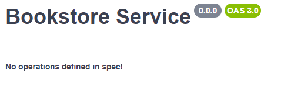
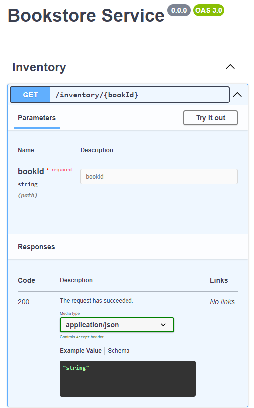
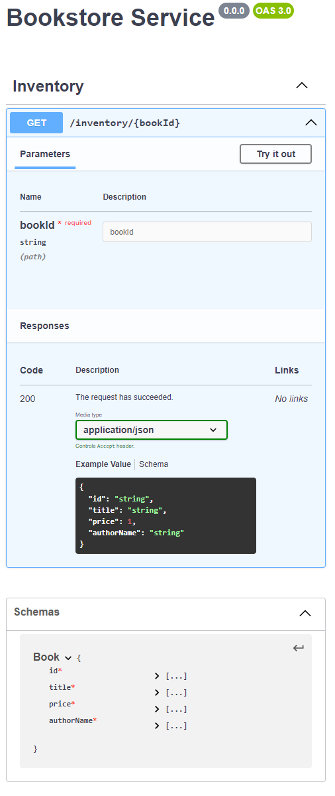
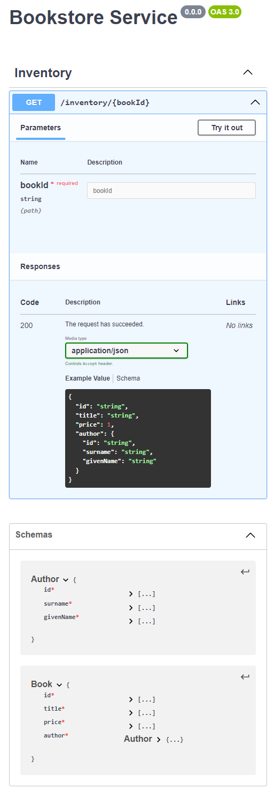
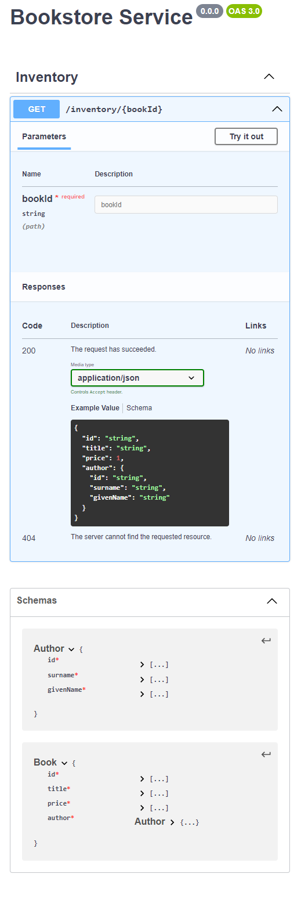

<link rel="stylesheet" href="../../stylesheets/page.css">

# Today I Learned - Using TypeSpec to Generate OpenAPI Specs

Recently, I was doing analysis for a project where we needed to build out a set of APIs for consumers to use. Even though [I'm a big believer of iterative design](), we wanted to have a solid idea of what the routes and data models were going to look like. 

In the past, I most likely would have generated a .NET Web API project, created the controllers/models, finally leveraging NSwag to generate Swagger documentation for the api. Even though this approach works, it does take more time on the implementation side (spinning up controllers, configuring ASP.NET, creating the models, adding attributes). In addition, if the actual API isn't being written in with .NET, then this code becomes throwaway pretty quickly.

Since tooling is always evolving, I stumbled across another tool, [TypeSpec](https://typespec.io/). Heavily influenced by TypeScript, this allows you to write your contracts and models that, when compiled, produces an OpenAPI compliant spec.

As a bonus, it's not restricted to just API spec as it has support for [generating JSON schemas](https://typespec.io/docs/emitters/json-schema/reference) and [gRPC's Protocol Buffers (protobuf)](https://typespec.io/docs/emitters/protobuf/reference)

## Getting Started

All code for this post can be found on [my GitHub](https://github.com/cameronpresley/typespec-examples).

Given that it's inspired by TypeScript, the tooling requires having Node installed (at least 20, but I'd recommend the long-term-supported (LTS) version).

From there, we can install the TypeSpec tooling with.

```sh
npm install @typespec/compiler
```

Even though this is all the tooling that's required, I'd recommend installing an extension for either Visual Studio or Visual Studio Code so that you can get Intellisense and other visual cues while you're writing the code.

## Bootstrapping the project

Now that we've got the tooling squared away, let's create our project. 

```sh
mkdir bookstore-api # let's make a directory to hold everything
cd bookstore-api
tsp init --template rest
```

Enter a project name and choose the defaults. Once it's finished bootstrapping, you can install necessary dependencies using `tsp install`.

## Building Our First API

For our bookstore application, let's say that we want to have an `inventory` route where someone can retrieve information about a book. 

For this work, I'm picturing the following

```md
# Route -> GET api/inventory/{id}
# Returns 200 or 404
```

In the project, locate the `main.tsp` file and add the following

```tsp
using TypeSpec.Http;
using TypeSpec.Rest;

@service({
    title: "Bookstore Service"
})
namespace Bookstore {

}
```

After adding this code, run `tsp compile .` (note the period). This will create a file in the `tsp-output/@typespec/openapi3` folder, `openapi.yaml`.

We can open that file and see what our OpenAPI spec looks like 

```yml
openapi: 3.0.0
info:
  title: Bookstore Service
  version: 0.0.0
tags: []
paths: {}
components: {}
```

So far, not much to look at. However, if we copy this code and render feed it to an online render (like [https://editor.swagger.io/](https://editor.swagger.io/)), we'll get a message about no operations.



<!--  -->

Let's change that by building out our GET endpoint.

Back in `main.tsp`, let's add more code to our `Bookstore` namespace.

```tsp
namespace Bookstore {
    @tag("Inventory")
    @route("inventory")
    namespace Inventory {
        @get op getBook(@path bookId:string): string
    }
}
```

After running `tsp compile .`, we'll see that our yaml has been updated and if we render it again, we'll have our first endpoint



This is closer to what we want, however, we know that we're returning back a `string`, but a `Book`.

For this exercise, we'll say that a `Book` has the following:

- an id (of number)
- a title (of string)
- a price (of number, minimum 1)
- author name (of string)

Let's add this model to `main.tsp`

```tsp
namespace Bookstore {
    // Note that we've added this to the Bookstore namespace
    model Book {
        id: string;
        title: string;

        @minValue(1)
        price: decimal;

        authorName: string;
    }
    @tag("Inventory")
    @route("inventory")
    namespace Inventory {
        
        // For our get, we're now returning a Book, instead of a string.
        @get op getBook(@path bookId: string): Book; 
    }
} 
```

After another run of `tsp compile` and rendering the yaml file, we see that we have a schema for our get method now.



## Refactoring a Model

Even though this works, the `Book` model is a bit lazy as it has the `authorName` as a property instead of an `Author` model which would have name (and a bit more information). Let's update `Book` to have an `Author` property.

```tsp
model Author {
    id: string;

    @minLength(1)
    surname: string;

    @minLength(1)
    givenName: string;
}
model Book {
    id: string;
    title: string;

    @minValue(1)
    price: decimal;

    author: Author;
}
```

After making this change, we can see that we now have a nested model for `Book`.



## Handling Failures

We're definitely a step in the right direction, however, our API definition isn't quite done. Right now, it says that we'll always return a 200 status code.

I don't know about you, but our bookstore isn't good enough to generate books with fictitious IDs, so we need to update our contract to say that it can also return 404s.

Back in `main.tsp`, we're going to change our return type of the `@get` operation to instead of being a `Book`, it's actually a [union type](https://www.typescriptlang.org/docs/handbook/2/everyday-types.html#union-types).

```tsp

@get op getBook(@path bookId: string): 
// Either it returns a 200 with a body of Book
{
    @statusCode statusCode: 200;
    @body book: Book;
} | { // Or it will return a 404 with an empty body
    @statusCode statusCode: 404;
};

```

With this final change, we can compile and render the yaml and see that route can return a 404 as well.



## Next Steps

When I first started with TypeSpec, my first thought was that you could put this code under continuous integration (CI) and have it produce the OpenAPI format as an artifact for other teams to pull in and auto-generate clients from.

If you're interested in learning more about that approach, [drop me a line at the Coaching Corner](mailto:CoachingCorner@TheSoftwareMentor.com?subject=I'd like to learn more about TypeSpec) and I may write up my results in a future post.

