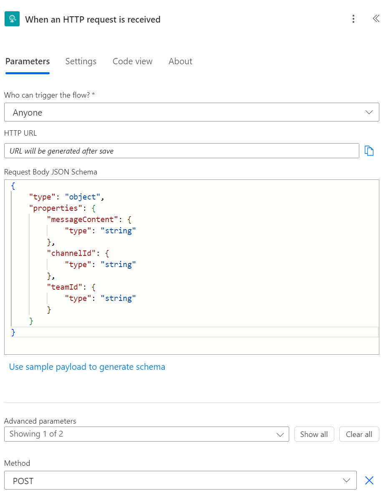
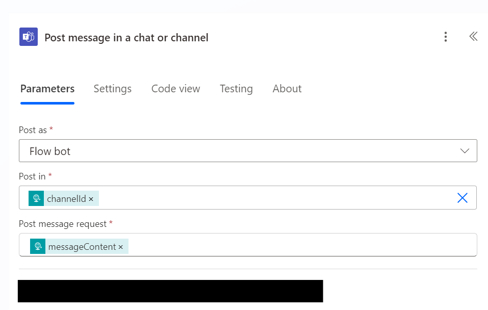
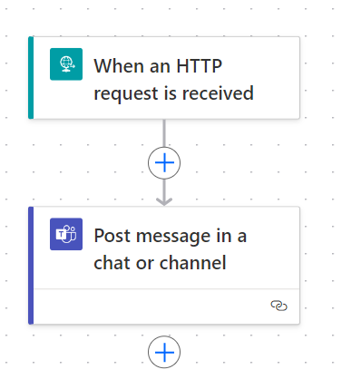

# Today I Learned: Triggering PowerAutomate Through Http Request

If you're working within the Microsoft ecosystem, you might have ran across a tool called [PowerAutomate](https://www.microsoft.com/en-us/power-platform/products/power-automate), this is Microsoft's low-code solution for building out simple automation (similar to tools like If This Then Than ([IFTTT](https://ifttt.com/))).

A common use I've used with PowerAutomate is integrating with Teams to kick off a workflow when someone posts a message. For example, you could have a trigger listening for when someone posts in your support channel to auto-respond back with a canned message and tagging whoever your support person or support team is.

The problem I've ran into with PowerAutomate is that it has a steep learning curve and isn't very intuitive for engineers to pick up. As such, we typically use PowerAutomate for simpler flows (or if we need to integrate with another Microsoft product like Teams or Planner).

Recently, I was tackling a problem where we had an application that needed to post a message into a Teams channel. Back in the day, I would have use a [webhook](https://learn.microsoft.com/en-us/microsoftteams/platform/webhooks-and-connectors/how-to/add-incoming-webhook?tabs=newteams%2Cdotnet) and published the message that way, however, Microsoft removed the ability to use Webhooks into Teams in late 2024. The main solution going forward is that you would have had to build a Teams application and install it for your tenant/channel. This can be a bit annoying if all you have is a simple workflow that you need to stand-up.

This got me thinking, I know I can use PowerAutomate to send a message to Teams, but can I trigger the flow programmatically (at this point, I was familiar with timers and when something happened).

Doing some digging, I found that PowerAutomate can trigger a workflow off of a _HTTP Request_. 

Jackpot! 

Even better, we can give the PowerAutomate flow a specific payload to expect as part of the request body, even better!

Combining these concepts, I can create a flow like the following:

First, let's set up a trigger that takes in a payload. In this case, the caller will give us the message content and a bit more info on which team and channel to post this message into.

After setting up the trigger, we can then add a step for posting a message in Teams. Instead of using the pre-populated options that we get from our connection, we can use the values from the trigger instead.

After saving, our entire flow looks like the following

From here, we can then use the URL that was created as part of the trigger and have our application invoke the flow.
