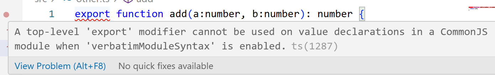
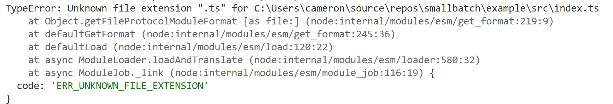

# Running Single File TypeScript in 5.9 with ts-node and tsx

On July 31, 2025, Microsoft released the next version of TypeScript, v5.9 ([click here for full release notes](https://devblogs.microsoft.com/typescript/announcing-typescript-5-9/))

One of the changes that caught my attention is what the default `tsconfig.json` looks like when you leverage `npx tsc --init`.

Before 5.9, when you ran `npx tsc --init`, you would get a default `tsconfig.json` that had _all_ the options outlined with most of them commented, but you could see what their default values would be.

## What Changed?

In this release, two changes were made to the `tsconfig.json`

- Instead of all the options being shown, now a subset of commonly tweaked settings are generated.
- There's now a section of _recommended_ settings that have values set.

**Before**

```json
{
  "compilerOptions": {
    /* Visit https://aka.ms/tsconfig to read more about this file */

    /* Projects */
    // "incremental": true,                              /* Save .tsbuildinfo files to allow for incremental compilation of projects. */
    // "composite": true,                                /* Enable constraints that allow a TypeScript project to be used with project references. */
    // "tsBuildInfoFile": "./.tsbuildinfo",              /* Specify the path to .tsbuildinfo incremental compilation file. */
    // "disableSourceOfProjectReferenceRedirect": true,  /* Disable preferring source files instead of declaration files when referencing composite projects. */
    // "disableSolutionSearching": true,                 /* Opt a project out of multi-project reference checking when editing. */
    // "disableReferencedProjectLoad": true,             /* Reduce the number of projects loaded automatically by TypeScript. */

    /* Language and Environment */
    "target": "es2016",                                  /* Set the JavaScript language version for emitted JavaScript and include compatible library declarations. */
    // "lib": [],                                        /* Specify a set of bundled library declaration files that describe the target runtime environment. */
    // "jsx": "preserve",                                /* Specify what JSX code is generated. */
    // "libReplacement": true,                           /* Enable lib replacement. */
    // "experimentalDecorators": true,                   /* Enable experimental support for legacy experimental decorators. */
    // "emitDecoratorMetadata": true,                    /* Emit design-type metadata for decorated declarations in source files. */
    // "jsxFactory": "",                                 /* Specify the JSX factory function used when targeting React JSX emit, e.g. 'React.createElement' or 'h'. */
    // "jsxFragmentFactory": "",                         /* Specify the JSX Fragment reference used for fragments when targeting React JSX emit e.g. 'React.Fragment' or 'Fragment'. */
    // "jsxImportSource": "",                            /* Specify module specifier used to import the JSX factory functions when using 'jsx: react-jsx*'. */
    // "reactNamespace": "",                             /* Specify the object invoked for 'createElement'. This only applies when targeting 'react' JSX emit. */
    // "noLib": true,                                    /* Disable including any library files, including the default lib.d.ts. */
    // "useDefineForClassFields": true,                  /* Emit ECMAScript-standard-compliant class fields. */
    // "moduleDetection": "auto",                        /* Control what method is used to detect module-format JS files. */

    /* Modules */
    "module": "commonjs",                                /* Specify what module code is generated. */
    // "rootDir": "./",                                  /* Specify the root folder within your source files. */
    // "moduleResolution": "node10",                     /* Specify how TypeScript looks up a file from a given module specifier. */
    // "baseUrl": "./",                                  /* Specify the base directory to resolve non-relative module names. */
    // "paths": {},                                      /* Specify a set of entries that re-map imports to additional lookup locations. */
    // "rootDirs": [],                                   /* Allow multiple folders to be treated as one when resolving modules. */
    // "typeRoots": [],                                  /* Specify multiple folders that act like './node_modules/@types'. */
    // "types": [],                                      /* Specify type package names to be included without being referenced in a source file. */
    // "allowUmdGlobalAccess": true,                     /* Allow accessing UMD globals from modules. */
    // "moduleSuffixes": [],                             /* List of file name suffixes to search when resolving a module. */
    // "allowImportingTsExtensions": true,               /* Allow imports to include TypeScript file extensions. Requires '--moduleResolution bundler' and either '--noEmit' or '--emitDeclarationOnly' to be set. */
    // "rewriteRelativeImportExtensions": true,          /* Rewrite '.ts', '.tsx', '.mts', and '.cts' file extensions in relative import paths to their JavaScript equivalent in output files. */
    // "resolvePackageJsonExports": true,                /* Use the package.json 'exports' field when resolving package imports. */
    // "resolvePackageJsonImports": true,                /* Use the package.json 'imports' field when resolving imports. */
    // "customConditions": [],                           /* Conditions to set in addition to the resolver-specific defaults when resolving imports. */
    // "noUncheckedSideEffectImports": true,             /* Check side effect imports. */
    // "resolveJsonModule": true,                        /* Enable importing .json files. */
    // "allowArbitraryExtensions": true,                 /* Enable importing files with any extension, provided a declaration file is present. */
    // "noResolve": true,                                /* Disallow 'import's, 'require's or '<reference>'s from expanding the number of files TypeScript should add to a project. */

    /* JavaScript Support */
    // "allowJs": true,                                  /* Allow JavaScript files to be a part of your program. Use the 'checkJS' option to get errors from these files. */
    // "checkJs": true,                                  /* Enable error reporting in type-checked JavaScript files. */
    // "maxNodeModuleJsDepth": 1,                        /* Specify the maximum folder depth used for checking JavaScript files from 'node_modules'. Only applicable with 'allowJs'. */

    /* Emit */
    // "declaration": true,                              /* Generate .d.ts files from TypeScript and JavaScript files in your project. */
    // "declarationMap": true,                           /* Create sourcemaps for d.ts files. */
    // "emitDeclarationOnly": true,                      /* Only output d.ts files and not JavaScript files. */
    // "sourceMap": true,                                /* Create source map files for emitted JavaScript files. */
    // "inlineSourceMap": true,                          /* Include sourcemap files inside the emitted JavaScript. */
    // "noEmit": true,                                   /* Disable emitting files from a compilation. */
    // "outFile": "./",                                  /* Specify a file that bundles all outputs into one JavaScript file. If 'declaration' is true, also designates a file that bundles all .d.ts output. */
    // "outDir": "./",                                   /* Specify an output folder for all emitted files. */
    // "removeComments": true,                           /* Disable emitting comments. */
    // "importHelpers": true,                            /* Allow importing helper functions from tslib once per project, instead of including them per-file. */
    // "downlevelIteration": true,                       /* Emit more compliant, but verbose and less performant JavaScript for iteration. */
    // "sourceRoot": "",                                 /* Specify the root path for debuggers to find the reference source code. */
    // "mapRoot": "",                                    /* Specify the location where debugger should locate map files instead of generated locations. */
    // "inlineSources": true,                            /* Include source code in the sourcemaps inside the emitted JavaScript. */
    // "emitBOM": true,                                  /* Emit a UTF-8 Byte Order Mark (BOM) in the beginning of output files. */
    // "newLine": "crlf",                                /* Set the newline character for emitting files. */
    // "stripInternal": true,                            /* Disable emitting declarations that have '@internal' in their JSDoc comments. */
    // "noEmitHelpers": true,                            /* Disable generating custom helper functions like '__extends' in compiled output. */
    // "noEmitOnError": true,                            /* Disable emitting files if any type checking errors are reported. */
    // "preserveConstEnums": true,                       /* Disable erasing 'const enum' declarations in generated code. */
    // "declarationDir": "./",                           /* Specify the output directory for generated declaration files. */

    /* Interop Constraints */
    // "isolatedModules": true,                          /* Ensure that each file can be safely transpiled without relying on other imports. */
    // "verbatimModuleSyntax": true,                     /* Do not transform or elide any imports or exports not marked as type-only, ensuring they are written in the output file's format based on the 'module' setting. */
    // "isolatedDeclarations": true,                     /* Require sufficient annotation on exports so other tools can trivially generate declaration files. */
    // "erasableSyntaxOnly": true,                       /* Do not allow runtime constructs that are not part of ECMAScript. */
    // "allowSyntheticDefaultImports": true,             /* Allow 'import x from y' when a module doesn't have a default export. */
    "esModuleInterop": true,                             /* Emit additional JavaScript to ease support for importing CommonJS modules. This enables 'allowSyntheticDefaultImports' for type compatibility. */
    // "preserveSymlinks": true,                         /* Disable resolving symlinks to their realpath. This correlates to the same flag in node. */
    "forceConsistentCasingInFileNames": true,            /* Ensure that casing is correct in imports. */

    /* Type Checking */
    "strict": true,                                      /* Enable all strict type-checking options. */
    // "noImplicitAny": true,                            /* Enable error reporting for expressions and declarations with an implied 'any' type. */
    // "strictNullChecks": true,                         /* When type checking, take into account 'null' and 'undefined'. */
    // "strictFunctionTypes": true,                      /* When assigning functions, check to ensure parameters and the return values are subtype-compatible. */
    // "strictBindCallApply": true,                      /* Check that the arguments for 'bind', 'call', and 'apply' methods match the original function. */
    // "strictPropertyInitialization": true,             /* Check for class properties that are declared but not set in the constructor. */
    // "strictBuiltinIteratorReturn": true,              /* Built-in iterators are instantiated with a 'TReturn' type of 'undefined' instead of 'any'. */
    // "noImplicitThis": true,                           /* Enable error reporting when 'this' is given the type 'any'. */
    // "useUnknownInCatchVariables": true,               /* Default catch clause variables as 'unknown' instead of 'any'. */
    // "alwaysStrict": true,                             /* Ensure 'use strict' is always emitted. */
    // "noUnusedLocals": true,                           /* Enable error reporting when local variables aren't read. */
    // "noUnusedParameters": true,                       /* Raise an error when a function parameter isn't read. */
    // "exactOptionalPropertyTypes": true,               /* Interpret optional property types as written, rather than adding 'undefined'. */
    // "noImplicitReturns": true,                        /* Enable error reporting for codepaths that do not explicitly return in a function. */
    // "noFallthroughCasesInSwitch": true,               /* Enable error reporting for fallthrough cases in switch statements. */
    // "noUncheckedIndexedAccess": true,                 /* Add 'undefined' to a type when accessed using an index. */
    // "noImplicitOverride": true,                       /* Ensure overriding members in derived classes are marked with an override modifier. */
    // "noPropertyAccessFromIndexSignature": true,       /* Enforces using indexed accessors for keys declared using an indexed type. */
    // "allowUnusedLabels": true,                        /* Disable error reporting for unused labels. */
    // "allowUnreachableCode": true,                     /* Disable error reporting for unreachable code. */

    /* Completeness */
    // "skipDefaultLibCheck": true,                      /* Skip type checking .d.ts files that are included with TypeScript. */
    "skipLibCheck": true                                 /* Skip type checking all .d.ts files. */
  }
}
```

**After**

```json
{
  // Visit https://aka.ms/tsconfig to read more about this file
  "compilerOptions": {
    // File Layout
    // "rootDir": "./src",
    // "outDir": "./dist",
    // Environment Settings
    // See also https://aka.ms/tsconfig/module
    "module": "nodenext",
    "target": "esnext",
    "types": [],
    // For nodejs:
    // "lib": ["esnext"],
    // "types": ["node"],
    // and npm install -D @types/node
    // Other Outputs
    "sourceMap": true,
    "declaration": true,
    "declarationMap": true,
    // Stricter Typechecking Options
    "noUncheckedIndexedAccess": true,
    "exactOptionalPropertyTypes": true,
    // Style Options
    // "noImplicitReturns": true,
    // "noImplicitOverride": true,
    // "noUnusedLocals": true,
    // "noUnusedParameters": true,
    // "noFallthroughCasesInSwitch": true,
    // "noPropertyAccessFromIndexSignature": true,
    // Recommended Options
    "strict": true,
    "jsx": "react-jsx",
    // "verbatimModuleSyntax": true,
    "isolatedModules": true,
    "noUncheckedSideEffectImports": true,
    "moduleDetection": "force",
    "skipLibCheck": true,
  }
}
```

I'm still working through my thoughts on these changes. On one hand, I like the fact that the tsconfig.json is much smaller now and that you can use VS Code to get intellisense on the other options. On the other, if you don't know what you're looking for, it was nice to just see what the options were (with their default values).

## Exports Not Working

After setting up a [new test application](./create-node-project.md), I tried running my app with `ts-node`, but got an error with one of my exports.



Huh, I'm not familiar with that setting, let's [look into it](https://www.typescriptlang.org/tsconfig/#verbatimModuleSyntax).

At a high level, this setting makes sure that you're not accidentally mixing CommonJS syntax (i.e. using `require` to access dependencies) with ESModule syntax (i.e. using `import` to access dependencies).

## Finding the Root Cause

Weird, I'm not aware that I'm using CommonJS syntax anywhere, so I wonder where that's coming from. Doing some digging, I find out that there's a `type` setting you can specify for `package.json` with the following docs:


Ah, yeah, that will do it. So the issue is that by default, when you generate a package.json file, it doesn't create a `type` setting, so by default, it will be CommonJS.

However, with TypeScript 5.9, the default configuration is assuming ESModule and with the `verbatimModuleSyntax` being set to true, this breaks our initial set-up scripts.

## Migrating to ESModule

Given the docs, the first thing I tried was to set the `type` setting in the package.json to `module`.

This fixed my import and now my index file looks like this

```ts
// I wasn't expecting to see an import from `other.js`, but 
// it seems like this is expected behavior (see https://nodejs.org/api/esm.html#mandatory-file-extensions)

import { add } from "./other.js";

const sum = add(2, 3);

console.log(sum);

```

At this point, I figured I was in a good spot, so I tried `npx ts-node src/index.ts` again.

However, I was greeted with the following:



## Fighting with ts-node

What in the world? I've never seen that error before, but doing some [more digging into ts-node](https://github.com/TypeStrong/ts-node?tab=readme-ov-file#commonjs-vs-native-ecmascript-modules), it turns out that the issue is that ts-node doesn't know how to load ESModules by default, so you need to get an ESM specific loader to work. The docs mention a few different ways to work around that, so I started trying them out.

No dice, even with trying all of that (and even some help with AI), I still wasn't able to get the TypeScript file to load. 

At the end of the day, if I wanted to stick with `ts-node`, I had to make the following changes.

- Update the `package.json` to have a type of `commonjs`
- Update the `tsconfig.json` to set `verbatimModuleSyntax` to be false
- Update the import in `index` to be `import {add} from "./other"`

This works, however, CommonJS is an old way of setting up files and I don't like that I had to turn off the `verbatimModuleSyntax` setting.

## An Alternative Solution with tsx

Doing more digging, I found an alternative tool to `ts-node`, `[tsx](https://tsx.is/)` which purports having a simpler configuration and better support for ESM. This package has been around for a while now, has good support, and is actively maintained, so let's give that a whirl.

```sh
npm install --save-dev tsx
```

After installing `tsx`, I changed my `package.json` back to having a type of `module` and set `verbatimModuleSyntax` back to its default setting of true.

Let's try to run the file

```sh
npx tsx src/index.ts

5
```
Hooray! I've never been happier to see basic addition working.

## Wrapping Up

I've been a big proponent of ts-node for a long-time now due to its easy-to-setup nature and how well it played with TypeScript out of the box. However, with the latest changes to TypeScript, I highly recommend using `tsx` over `ts-node` as it just seems to work without having to mess with a bunch of other settings. With the friction I ran into and the direction TypeScript is going, I'll be curious to see how ts-node evolves over time.

