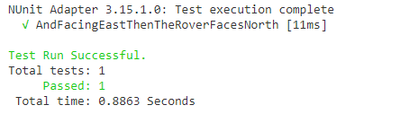

# Mars Rover – Implementing Rover : Turning Left

Welcome to the seventh installment of Learning Through Example – Mars Rover! In this post, we’re going to start driving out the functionality for the `Rover` and the business rules for turning left! First, we’ll take a look at the requirements to make sure we have an idea of what’s needed. From there, we’ll start implementing the requirements. By the end of this post, we’ll have a `Rover` that can do 3/4 of the possible commands!

## Turning in Place By Turning Left
If we look back at the original [requirements](./mars-rover-definition.md#problem-description) for turning left, we find this single line as the requirement

> When the rover is told to turn left, it will rotate 90 degrees to the left, but not change its location

Given this requirement, we’re able to double check with our Subject Matter Expert that the `Rover` is essentially rotating in place which yields the following requirements.

- Given the `Rover` is facing `North`, when it turns left, then the `Rover` should be facing `West` at the same Coordinate
- Given the `Rover` is facing `West`, when it turns left, then the `Rover` should be facing `South` at the same Coordinate
- Given the `Rover` is facing `South`, when it turns left, then the `Rover` should be facing `East` at the same Coordinate
- Given the `Rover` is facing `East`, when it turns left, then the `Rover` should be facing `North` at the same Coordinate

Even though we’ve not written tests that have this exact setup, it looks like we should be able to use that as a start while we’re implementing. So let’s go ahead tackle the first requirement!

## Red/Green/Refactor For Rover Facing North

Leaning on lessons learned previously, we can write the following test for when the `Rover` is facing `North`.

```csharp
[Test]
public void AndFacingNorthThenTheRoverFacesWest()
{
  var rover = new Rover {Orientation=Direction.North};
  var initialLocation = rover.Location;
  
  rover.TurnLeft();
  
  Assert.AreEqual(initialLocation, rover.Location);
  Assert.AreEqual(Direction.West, rover.Orientation);
}
```

Not too bad of a setup! First, we create the `Rover` and capture its `initialLocation`. From there, we call our new method, `TurnLeft` which doesn’t exist yet, but will soon. After `TurnLeft` has been called, we check to make sure that our `Location` is the same and that our `Orientation` has been updated accordingly.

Now let’s write just enough code to pass.

```csharp
public void TurnLeft()
{
  if (Orientation == Direction.North) {
    Orientation = Direction.West;
  }
}
```

Pretty straightforward implementation and is good enough to make the test pass. Not much to refactor at this point so let’s go ahead and work on the next test case.

## Red/Green/Refactor For Rover Facing West

For the next test, let’s go ahead and write one for when the `Rover` faces `West`

```csharp
[Test]
public void AndFacingWestThenTheRoverFacesSouth()
{
  var rover = new Rover {Orientation=Direction.West};
  var initialLocation = rover.Location;
  
  rover.TurnLeft();
  
  Assert.AreEqual(initialLocation, rover.Location);
  Assert.AreEqual(Direction.South, rover.Orientation);
}
```

And now enough code to make it pass

```csharp
public void TurnLeft()
{
  if (Orientation == Direction.North) {
    Orientation = Direction.West;
  }
  else if (Orientation == Direction.West) {
    Orientation = Direction.South;
  }
}
```

Once again, now that we have passing tests, is there anything we want to refactor? The business rules look to be simple enough so I don’t feel the need to refactor those. When we look at the test code, the test seems straightforward and I’m not sure what I’d simplify.

Time to commit these changes and on to the next requirement.

## Red/Green/Refactor For Rover Facing South

Third verse same as the first, we can write a failing test for when the `Rover` faces `South`.

```csharp
[Test]
public void AndFacingSouthThenTheRoverFacesEast()
{
  var rover = new Rover {Orientation=Direction.South};
  var initialLocation = rover.Location;
  
  rover.TurnLeft();
  
  Assert.AreEqual(initialLocation, rover.Location);
  Assert.AreEqual(Direction.East, rover.Orientation);
}
```

And now enough code to make it pass

```csharp
public void TurnLeft()
{
  if (Orientation == Direction.North) {
    Orientation = Direction.West;
  }
  else if (Orientation == Direction.West) {
    Orientation = Direction.South;
  }
  else if (Orientation == Direction.South) {
    Orientation = Direction.East;
  }
}
```

With everything passing again, we can pause to rethink about refactoring but so far so good from my perspective. There are maybe some superficial changes that could be made, but I can’t make a strong enough argument to implement them.

Time to commit and tackle the last requirement!

## Red/Green/Refactor for Rover Facing East

Let’s go ahead and write the final test for when the `Rover` faces `East`

```csharp
[Test]
public void AndFacingEastThenTheRoverFacesNorth()
{
  var rover = new Rover {Orientation=Direction.East};
  var initialLocation = rover.Location;
  
  rover.TurnLeft();
  
  Assert.AreEqual(initialLocation, rover.Location);
  Assert.AreEqual(Direction.North, rover.Orientation);
}
```

And now enough code to make it pass

```csharp
public void TurnLeft()
{
  if (Orientation == Direction.North) {
    Orientation = Direction.West;
  }
  else if (Orientation == Direction.West) {
    Orientation = Direction.South;
  }
  else if (Orientation == Direction.South) {
    Orientation = Direction.East;
  }
  else if (Orientation == Direction.East) {
    Orientation = Direction.North;
  }
}
```

## There Seems To Be a Pattern

Now that we have a few tests in place, it seems like all of the tests are following a pretty straightforward pattern:

1. Create a `Rover` with a particular `Orientation`
1. Get the starting `Location`
1. Call `TurnLeft`
1. Verify that the `Location` didn’t change
1. Verify that the `Orientation` is correct

### Parameterized Testing

When I find myself writing tests where the tests look exactly the same and the only difference is the initial data and expected output, then I start thinking about how to parameterize the test so that the test is run multiple times, but with different parameters. By making this change, we reduce the amount of test code written, without sacrificing readability or maintainability.

### When To Not Parameterize

It seems like it would be easy to write tests in this fashion, so why don’t we use this technique all the time?

The primary reason why we wouldn’t want to use this approach is if we would need to pass in a ton of parameters in order to make this test generic enough. A general guideline I use is that if the total parameters are three or less, then parameterization is a good fit. However, if I find out that I need to pass in more than three parameters, it makes me wonder if the tests are really the same test at all.

A secondary reason why this approach may not be a good fit is if it clouds our readability and debug-ability of the tests. Recall that our tests help us drive out our requirements and helps us talk in a ubiquitous language. If we can no longer do that easily, then we should not parameterize our tests.

## Refactoring

With all of that said, let’s take a look at our tests for `WhenTurningLeft` and see what each of the tests have in common.

```csharp hl_lines="7 13 19 25 31 37 43 49"
[TestFixture]
public class WhenTurningLeft
{
  [Test]
  public void AndFacingNorthThenTheRoverFacesWest()
  {
    var rover = new Rover {Orientation=Direction.North};
    var initialLocation = rover.Location;
    
    rover.TurnLeft();
    
    Assert.AreEqual(initialLocation, rover.Location);
    Assert.AreEqual(Direction.West, rover.Orientation);
  }
  
  [Test]
  public void AndFacingWestThenTheRoverFacesSouth()
  {
    var rover = new Rover {Orientation=Direction.West};
    var initialLocation = rover.Location;
    
    rover.TurnLeft();
    
    Assert.AreEqual(initialLocation, rover.Location);
    Assert.AreEqual(Direction.South, rover.Orientation);
  }
  
  [Test]
  public void AndFacingSouthThenTheRoverFacesEast()
  {
    var rover = new Rover {Orientation=Direction.South};
    var initialLocation = rover.Location;
    
    rover.TurnLeft();
    
    Assert.AreEqual(initialLocation, rover.Location);
    Assert.AreEqual(Direction.East, rover.Orientation);
  }
  
  [Test]
  public void AndFacingEastThenTheRoverFacesNorth()
  {
    var rover = new Rover {Orientation=Direction.East};
    var initialLocation = rover.Location;
    
    rover.TurnLeft();
    
    Assert.AreEqual(initialLocation, rover.Location);
    Assert.AreEqual(Direction.North, rover.Orientation);
  }
}
```

If we examine a bit closer, we’ll notice that the only differences are the starting `Orientation` and the expected `Orientation`. Since those are the only values that we would need to parameterize, this is a great candidate for parameterization!

So starting off slow, we’re going to refactor the `AndFacingEastThenTheRoverFacesNorth` test to use NUnit’s [TestCase attribute](https://github.com/nunit/docs/wiki/TestCase-Attribute) to pass in the parameters. Even though we’re using NUnit for this functionality, most test frameworks support this concept, just with different syntax.

```csharp hl_lines="2 3 5 10"
[Test]
[TestCase(Direction.East, Direction.North, TestName = "AndFacingEastThenTheRoverFacesNorth")]
public void RoverTurningLeft(Direction start, Direction expected)
{
  var rover = new Rover { Orientation = start };
  var initialLocation = rover.Location;

  rover.TurnLeft();

  Assert.AreEqual(expected, rover.Orientation);
  Assert.AreEqual(initialLocation, rover.Location);
}
```

With these changes in place, let’s break down what our approach was.

First, we added the `TestCase` attribute to the test as this allows us to specify parameters. In this case, we’re passing in two parameters (`Direction.East` and `Direction.North`). In addition, we’re also giving this `TestCase` a unique test name by setting the `TestName` property to `AndFacingEastThenTheRoverFacesNorth`. By setting this property, we’re controlling what this test will show up in the test runner.

Second, we changed the signature of the test method to take in two `Direction`s, one for the `start` and the other for the `expected` direction for `Rover`. These new parameters line up with the ordering of parameters in the `TestCase`. In addition, since this test is going to be a bit more generic, I renamed this method to `RoverTurningLeft` because the `TestName` is going to have my requirement and this method is the generic shell.

Finally, we updated how we initialized the `Rover` by setting it’s `Orientation` to be `start` and we changed our `Assert` to be on `expected`.

## Verifying The Changes

With this new test in place, let’s run it and verify that our changes worked

<figure markdown>
  
  <figcaption>Single test passing for when Rover faces North</figcaption>
</figure>


Nice! Let’s go ahead and add additional TestCase attributes for the other tests

```csharp hl_lines="2 3 4"
[Test]
[TestCase(Direction.North, Direction.West, TestName = "AndFacingNorthThenTheRoverFacesWest")]
[TestCase(Direction.West, Direction.South, TestName = "AndFacingWestThenTheRoverFacesSouth")]
[TestCase(Direction.South, Direction.East, TestName = "AndFacingSouthThenTheRoverFacesEast")]
[TestCase(Direction.East, Direction.North, TestName = "AndFacingEastThenTheRoverFacesNorth")]
public void RoverTurningLeft(Direction start, Direction expected)
{
  var rover = new Rover { Orientation = start };
  var initialLocation = rover.Location;

  rover.TurnLeft();

  Assert.AreEqual(expected, rover.Orientation);
  Assert.AreEqual(initialLocation, rover.Location);
}
```

And if we run our test suite, we verify that everything passes!

<figure markdown>
  
  <figcaption>All four tests passing</figcaption>
</figure>

With this in place, we can remove the other tests in this file, which yields the following test class.

```csharp
[TestFixture]
public class WhenTurningLeft
{  
  [Test]
  [TestCase(Direction.North, Direction.West, TestName = "AndFacingNorthThenTheRoverFacesWest")]
  [TestCase(Direction.West, Direction.South, TestName = "AndFacingWestThenTheRoverFacesSouth")]
  [TestCase(Direction.South, Direction.East, TestName = "AndFacingSouthThenTheRoverFacesEast")]
  [TestCase(Direction.East, Direction.North, TestName = "AndFacingEastThenTheRoverFacesNorth")]
  public void RoverTurningLeft(Direction start, Direction expected)
  {
    var rover = new Rover { Orientation = start };
    var initialLocation = rover.Location;

    rover.TurnLeft();

    Assert.AreEqual(expected, rover.Orientation);
    Assert.AreEqual(initialLocation, rover.Location);
  }
}
```

Already we can see how easy it would be to extend this test suite if a new `Direction` were to be added by adding the new `TestCase` and updating the other ones as needed.

## Wrapping Up

Goodness, just like that we have a `Rover` that knows how to `MoveForward`, `MoveBackward`, and `TurnLeft`! In this post, we added some new functionality to `Rover` by first examining the requirements and implementing them one at a time. From there, we noticed during our refactor step that our test code looked similar, just differing on inputs. This, in turn, inspired us to look at parameterized testing which allowed us to drastically reduce the amount of code needed for the various use cases and allows us to add additional cases easier in the future. In the next post, we start taking a look at some interesting patterns that `Rover` is exhibiting in its three methods.